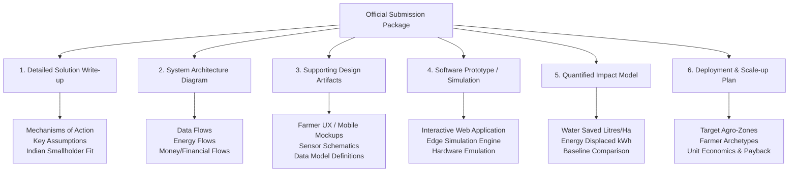

# Official Submission Requirements & Deliverables Matrix

**Reference:** Yuva Yodha Energy Tech Hackathon 2026  
**Document Code:** HACK-REQ-02  
**Evaluation Target:** Phase 1 (Idea Submission) & Phase 2 (Prototype & Evaluation)  

---

## 1. Core Submission Deliverables (Phase 1)

Every candidate submission must provide clear documentation addressing the six official deliverable vectors outlined on the hackathon challenges page:

---

## 2. Granular Requirements Specification

### Deliverable 1: Detailed Solution Write-Up
* **Mechanism of Action:** How does the proposed intervention physically and digitally change the farm's operational baseline? (e.g., transition from unmetered manual flood irrigation to solar-powered, crop-demand-driven pulsed irrigation with surplus power diverted to cold storage).
* **Key Assumptions:** Transparently list soil infiltration rates, solar irradiance curves, pump motor efficiencies, and network latency assumptions.
* **Indian Smallholder Fit:** Explicitly demonstrate compatibility with small farm sizes (<2 hectares), low upfront capital capacity, erratic electric grid supply, and vernacular literacy barriers.

### Deliverable 2: System Architecture Diagram
* **Component Layers:**
  1. *Perception & Sensing:* Physical soil moisture/temperature, ambient weather, and pump electrical parameters.
  2. *Edge Execution:* On-premise motor control, MPPT solar tracking, VFD speed regulation, and offline decision logic.
  3. *Connectivity:* Local wireless (BLE/LoRaWAN) and cellular backhaul (GSM/4G/NB-IoT) with offline queuing.
  4. *Cloud & Analytics:* Agronomic digital twins, satellite vegetative indices, weather forecasts, and FPO aggregation.
  5. *User & Community Interfaces:* Vernacular farmer mobile app, IVR/SMS voice engine, and DISCOM/FPO dashboard.
* **Three Flow Vectors Required:**
  - **Data Flow:** Sensor readings → Edge filtering → Cloud models → Actionable advisory/actuation.
  - **Energy Flow:** Solar PV generation → Inverter/VFD → Submersible pump → Surplus diversion to battery/cold-room/agro-processing.
  - **Money/Economic Flow:** Subsidies (PM-KUSUM) → Farmer co-pay → Energy cost savings → Crop yield premium → Payback recovery.

### Deliverable 3: Supporting Design Artifacts
* **Farmer UX:** High-contrast, multilingual (Hindi, Marathi, English) mobile interface designed for outdoor sunlight visibility and low digital literacy (iconographic & voice-first).
* **Data Model:** Normalized entity-relationship schema for fields, soil types, crop growth stages, irrigation logs, and energy telemetry.
* **Hardware & Retrofit Schematics:** Plug-and-play wiring diagram illustrating how the edge controller intercepts existing DOL/Star-Delta pump starters and solar VFDs.

### Deliverable 4: Software Prototype or Simulation
* **Scope:** Although physical hardware is not mandatory, an interactive software prototype demonstrating the full causal loop is crucial for high judging marks.
* **Simulation Core:** A real-time simulator that models:
  1. Diurnal solar irradiation curve;
  2. Submersible pump motor hydraulic curve ($Q$ vs. $H$);
  3. Soil moisture depletion under FAO-56 Penman-Monteith evapotranspiration;
  4. Automated irrigation valve triggering and subsequent power diversion to micro-cold storage.

### Deliverable 5: Quantified Benefit & Baseline Model
* **Baseline Identification:** State explicit benchmarks from official Indian government reports (e.g., Central Ground Water Board 2023, Central Electricity Authority 2024, ICAR-CIPHET).
* **Metric Units:**
  - Water: $\text{m}^3/\text{ha}$ or $\text{litres/kg produce}$.
  - Energy: $\text{kWh/ha}$ or specific energy consumption $\text{kWh/m}^3$ water pumped.
  - Emissions: $\text{kg CO}_2\text{e}$ avoided per hectare/year.
  - Economic: Net annual income increase in INR ($\text{₹/farmer}$).

### Deliverable 6: Deployment & Scale-Up Plan
* **Target Segments:** High-stress agro-climatic zones (e.g., Marathwada, Vidarbha, Western Rajasthan, Rayalaseema).
* **Target Crops:** High water-intensity cash crops (sugarcane, cotton, paddy) and high-value perishables (horticulture, tomatoes, chillies).
* **Go-to-Market Channels:** Farmer Producer Organizations (FPOs), primary agricultural credit societies (PACS), and PM-KUSUM system integrators.
