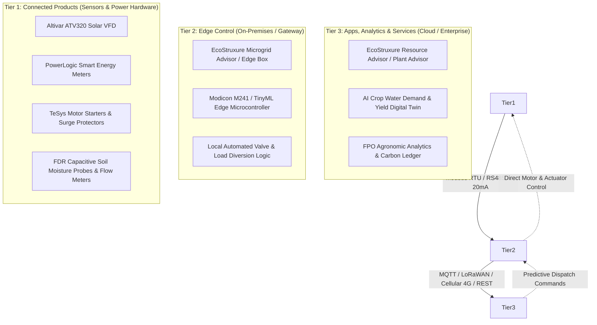

# 03 EcoStruxure™ Architecture & Open Automation

**Document Code:** SE-ARCH-03  
**Domain:** IoT-Enabled Open System Architecture & 3-Tier Digital Stack  

---

## 1. The 3-Tier EcoStruxure™ Framework

Schneider Electric’s signature technology architecture is **EcoStruxure™** ("Innovation at Every Level"). Any technical proposal submitted to a Schneider Electric jury must demonstrate organic alignment with this three-tier model:

---

## 2. Detailed Layer Specifications

### Tier 1: Connected Products
* **Definition:** Physical equipment embedded with communication intelligence, sensors, breakers, actuators, and power converters.
* **Relevant Agricultural Assets:**
  - **Altivar ATV320 Solar VFD:** Solar variable speed pump driver.
  - **TeSys Motor Starters & Overload Relays:** Electromechanical motor safety.
  - **PowerLogic PM5000 / PM8000 Meters:** Accurate kWh, power factor, and voltage THD logging.
  - **In-Field Sensors:** Soil moisture (volumetric water content at root depths), canopy temperature, and pressure line flow sensors.

### Tier 2: Edge Control
* **Definition:** Localized hardware and software that execute real-time, mission-critical closed-loop control without waiting for cloud connectivity.
* **Why Edge is Mandatory in Rural India:**
  - Rural cellular connectivity (2G/4G) is notoriously intermittent in agricultural fields.
  - An irrigation system that relies on a cloud API round-trip to turn off a high-pressure pump will cause pipe bursts or pump dry-runs if network drops.
* **Schneider Edge Capabilities:**
  - **Local Modbus/RS485 Bus:** Connects sensors, energy meters, and VFD inverters to an on-site edge controller.
  - **Offline Fault Isolation:** Instantaneous pump cutoff on dry-run, motor over-temperature, or pipe burst.
  - **Local Microgrid Balancing:** Automatically shifts solar power away from the pump motor to community battery/storage when soil moisture reaches field capacity.

### Tier 3: Apps, Analytics & Services
* **Definition:** Cloud-hosted enterprise applications, predictive AI models, digital twins, and advisory dashboards.
* **Capabilities:**
  - Satellite remote sensing integration (Sentinel-2 NDVI/NDWI) for macro field vigor.
  - Physics-based evapotranspiration ($ET_0$) weather integration (Open-Meteo).
  - Multi-tenant aggregation for Farmer Producer Organizations (FPOs), agribusinesses, and DISCOM grid operators.
