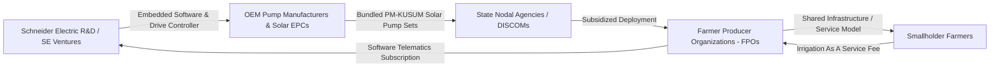

# 05 Relevant Schneider Products, Platforms & Business Models

**Document Code:** SE-PROD-05  
**Domain:** Product Portfolio Mapping & Commercial Viability  

---

## 1. Product & Platform Cross-Reference Table

| Schneider Electric Brand / Product | Category | Technical Specification | Role in Proposed Agriculture Solution |
|---|---|---|---|
| **Altivar Solar ATV320** | Connected Products / Drive | 0.37 kW to 15 kW, built-in MPPT, IP21/IP66, dual supply AC/DC | Primary solar pump motor drive; adjusts frequency to sunlight |
| **TeSys D / TeSys K** | Connected Products / Starter | Contactors, thermal overload relays, up to 150A | Electromechanical isolation, motor safety, phase protection |
| **PowerLogic PM5000 / PM3000** | Connected Products / Metering | Class 0.5S/1.0 accuracy, RS485 Modbus RTU, THD analysis | Real-time monitoring of pump kWh, power factor, voltage |
| **Modicon M221 / M241** | Edge Control / PLC | Micro-PLCs with embedded Ethernet/Serial, Modbus, PID loops | Industrial edge controller for automated valve & load routing |
| **EcoStruxure Microgrid Advisor** | Edge Control / Software | Real-time optimization, load forecasting, dynamic scheduling | Brain for routing surplus solar power to storage/processing |
| **EcoStruxure Plant Data Expert** | Apps & Analytics / Software | Industrial IoT data ingestion, time-series telemetry | Backend ingestion of fleet pump telematics and water levels |
| **EcoStruxure Water and Wastewater** | Apps & Analytics / Vertical | Hydraulic network modeling, leak detection, asset monitoring | Optimization of agricultural pipe distribution networks |

---

## 2. Synergistic Business Models for Schneider Electric India

How would Schneider Electric take an upgraded solution to market in India without building a direct-to-consumer rural sales force?

1. **OEM Hardware Bundling (B2B):**
   - Schneider packages its Altivar solar drive and our intelligent edge firmware as an all-in-one "Smart Solar Pump Controller" sold directly to major Indian pump OEMs (e.g., Kirloskar, Shakti Pumps, CRI, Texmo).
2. **PM-KUSUM System Integrator Integration (B2G/B2B):**
   - Under PM-KUSUM Component B (standalone pumps) and Component C (feeder solarization), government tenders mandate Remote Monitoring Systems (RMS) with 5-year uptime guarantees. Our edge controller satisfies all RMS compliance while adding closed-loop water intelligence.
3. **FPO-Driven "Energy & Irrigation as a Service" (EaaS):**
   - High-capacity 7.5HP to 10HP solar pumps and micro-cold rooms are owned by FPOs or rural entrepreneurs. Smallholder farmers pay per hour of pressurized drip irrigation or per crate of cold storage, eliminating individual farmer capex.
