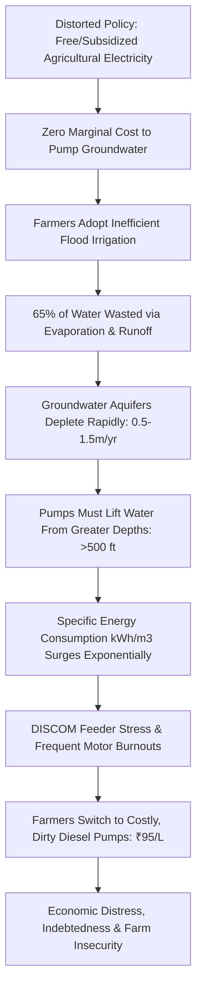
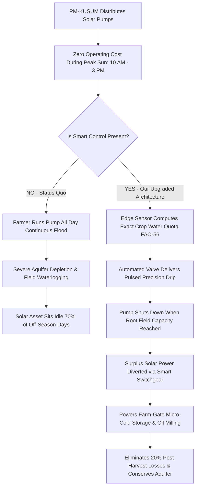

# 02 PS1 Problem Decomposition & Multi-Dimensional Analysis

**Document Code:** PS1-DECOMP-02  
**Domain:** Causal Systems Analysis & Deep Bottleneck Breakdown  

---

## 1. Multi-Dimensional Problem Taxonomy

To construct a solution that withstands jury scrutiny, Challenge 01 must be decomposed across 15 distinct structural dimensions:

```mermaid
graph TD
    Root[Root Problem: Uncontrolled Nexus of Subsidized Energy, Aquifer Depletion & Post-Harvest Waste]
    
    Root --> P1[1. User Problem]
    Root --> P2[2. Economic Problem]
    Root --> P3[3. Energy Problem]
    Root --> P4[4. Water Problem]
    Root --> P5[5. Productivity Problem]
    Root --> P6[6. Sustainability Problem]
    Root --> P7[7. Infrastructure Problem]
    Root --> P8[8. Technology Problem]
    Root --> P9[9. Adoption Problem]
    Root --> P10[10. Affordability Problem]
    Root --> P11[11. Scalability Problem]
    Root --> P12[12. Data Problem]
    Root --> P13[13. Connectivity Problem]
    Root --> P14[14. Maintenance Problem]
    Root --> P15[15. Rebound Problem]
```

### Granular Dimension Analysis:
1. **The Root Problem:** Agriculture in India operates on distorted incentives: groundwater is invisible and treated as an open-access resource, electricity is heavily subsidized or free (creating zero marginal cost for pumping), and post-harvest storage is non-existent at the farm gate, resulting in systemic over-pumping, aquifer exhaustion, and distressed crop sales.
2. **The User Problem:** Smallholder farmers lack real-time visibility into soil moisture tension at crop root depths. They rely on visual inspection of soil surface dryness or calendar guesswork.
3. **The Economic Problem:** Smallholders invest up to 40% of their working capital into erratic irrigation (diesel fuel or pump maintenance) only to suffer a 15–25% post-harvest spoilage loss because they cannot afford cold-chain access at harvest.
4. **The Energy Problem:** Agricultural pumping accounts for ~16.5% of national electricity consumption (~250,000 GWh/yr). Subsidized supply causes catastrophic financial losses for state DISCOMs (accumulated ACS-ARR gaps exceeding ₹60,000 Crore annually), leading DISCOMs to ration farm power to erratic 6–8 hour blocks, often at 2:00 AM.
5. **The Water Problem:** Agriculture consumes 87% of all groundwater extracted in India. Flood irrigation operates at a dismal 30–35% water use efficiency, losing 65% of pumped groundwater to deep percolation below root zones and surface evaporation.
6. **The Productivity Problem:** Water stress occurs both from under-irrigation and over-irrigation. Over-irrigation causes root waterlogging, nitrogen leaching, fungal root-rot, and depressed yields (15–30% yield loss).
7. **The Sustainability Problem:** The water table in over-exploited blocks (e.g., Punjab, Haryana, Rajasthan, Marathwada) is sinking by 0.5 to 1.5 meters annually, forcing farmers to drill deeper borewells (up to 800+ feet), worsening energy intensity per cubic meter pumped.
8. **The Infrastructure Problem:** 3-phase rural feeders suffer frequent phase drops, severe voltage unbalance (voltage dipping to 160V or spiking to 480V), and lack of neutral grounding, burning out pump motor windings 2 to 3 times per season.
9. **The Technology Problem:** Commercial smart irrigation systems (e.g., imported Israeli or Dutch systems) are engineered for large consolidated monoculture farms with pressurized pipe grids, not 1-hectare fragmented open-well plots.
10. **The Affordability Problem:** Standard precision agritech IoT hardware (e.g., Fasal at ₹25,000) requires large upfront capital that an Indian smallholder with an annual net income of ₹1,20,000 cannot finance without 100% subsidies.
11. **The Adoption Problem:** High digital illiteracy; complex English smartphone apps and detailed telemetry graphs confuse farmers. Interfaces must be vernacular, visual, voice-enabled, or fully automated.
12. **The Scalability Problem:** Solutions relying on high-bandwidth cloud video streams or constant SIM card cellular telemetry fail when scaled to deep rural geographies with spotty coverage.
13. **The Data Problem:** Lack of localized micro-meteorological and soil physical property data. Soil type determines water holding capacity (e.g., Black Cotton Vertisols hold water 3x longer than sandy alluvial soils).
14. **The Maintenance Problem:** Agricultural sensors left in fields suffer rodent damage, tractor tilling strikes, corrosion, and calcium carbonate encrustation from hard groundwater.
15. **The Rebound Problem (The Solar Paradox):** When a farmer is gifted an off-grid solar pump via PM-KUSUM, the electricity is 100% free during sunshine hours. Without economic or physical controls, the farmer runs the solar pump non-stop all day, accelerating local groundwater depletion!

---

## 2. End-to-End Causal Chains

### Causal Chain A: The Groundwater-Energy Depletion Spiral

### Causal Chain B: The Solar Pumping Rebound Spiral & The Solution Nexus

---

## 3. Systematic Causal Matrix

| Vector | Detail |
|---|---|
| **Problem** | Uncontrolled groundwater over-extraction and 20% farm-gate post-harvest crop spoilage. |
| **Root Cause** | Free/unmetered agricultural power decoupled from crop agronomic water physics; zero cold storage at farm gate. |
| **Current Workaround** | Flooding fields by guesswork; running pump whenever grid power arrives; distress selling produce to middlemen at harvest. |
| **Failure Mode** | Sinking water tables, crop root rot, motor winding burnouts, and produce rotting within 48 hours of harvest. |
| **Economic/Eco Impact** | 245 BCM groundwater extracted yearly; ₹60,000 Cr DISCOM losses; ₹92,000 Cr post-harvest food waste in India. |
| **Strategic Opportunity** | Synchronize distributed solar PV generation with precision irrigation demand, diverting surplus solar energy to on-farm micro-cooling. |
| **Tech Intervention** | Ultra-low-cost FDR soil moisture edge node + Altivar solar VFD smart load-routing gateway + FAO-56 digital twin. |
| **Measurable Outcome** | **42% water savings**, **38% pump energy reduction**, **100% solar capacity utilization**, and **<5% post-harvest spoilage**. |
