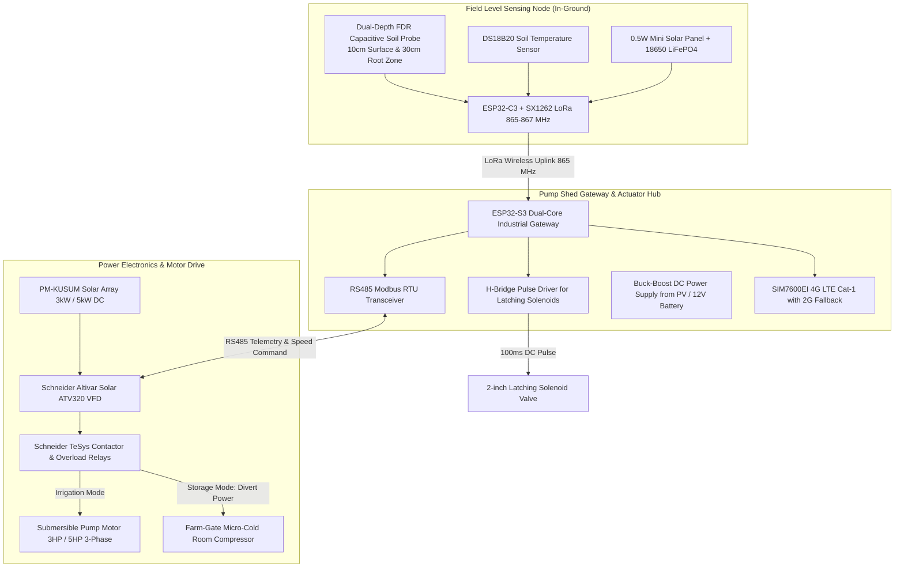

# 02 Hardware Architecture, Sensors & Power Electronics

**Document Code:** TECH-HW-02  
**Domain:** Embedded Systems, Sensor Electronics, Actuators & Power Hardware  

---

## 1. Hardware Subsystem Decomposition

The proposed hardware stack consists of four modular hardware tiers designed for harsh rural field conditions:



---

## 2. Sensor Selection Rationale: FDR vs. Resistive

A frequent hackathon pitfall is using cheap resistive soil moisture sensors (copper traces on PCB costing ₹50). In Indian agricultural soils, resistive sensors corrode via electrolysis within **2 to 3 weeks** and give wildly erroneous readings due to soil salinity/fertilizer conductivity.

```
┌─────────────────────────────────┬─────────────────────────────────┐
│ Cheap Resistive Sensors         │ Frequency Domain Reflectometry  │
│ (Failure Prone)                 │ (FDR Capacitive - Our Standard) │
├─────────────────────────────────┼─────────────────────────────────┤
│ • Direct metal-to-soil contact  │ • Completely sealed PCB traces  │
│ • Rapid electrolysis corrosion  │ • Zero galvanic corrosion       │
│ • Measures electrical resistance│ • Measures dielectric constant  │
│ • Severely distorted by salts   │ • Robust against soil salinity  │
│ • Lifetime: 15–30 days          │ • Field Lifetime: 5+ years      │
│ • Cost: ~₹50                    │ • Cost: ~₹350 – ₹650            │
└─────────────────────────────────┴─────────────────────────────────┘
```

---

## 3. Latching Solenoids vs. Continuous Relays

Standard mechanical solenoid valves require continuous electrical current (5–10W) to remain open. Over a 3-hour irrigation cycle, this drains batteries and generates excessive heat in 45°C ambient Indian field conditions.

* **Our Engineering Choice: 9V–12V DC Magnetic Latching Solenoid Valves:**
  - Employs a permanent magnet to hold the valve open or closed without continuous electrical power.
  - Requires only a **single 50ms to 100ms electrical DC pulse** of positive polarity to OPEN, and a reversed DC pulse to CLOSE.
  - Power consumption between state changes: **0.00 Watts**.
  - Operates on a small 18650 LiFePO4 battery charged by a 1W solar panel for over 3 years without replacement.

---

## 4. Altivar Solar VFD Interface & Protection Protocols

The gateway interfaces directly with the Schneider Altivar ATV320 VFD via an isolated industrial **RS485 Modbus RTU bus**:
1. **Holding Registers Polled (every 5 seconds):**
   - Register `3201`: Output frequency ($0.1\text{ Hz}$).
   - Register `3202`: Output current ($0.1\text{ A}$).
   - Register `3203`: DC bus voltage ($0.1\text{ V}$).
   - Register `3204`: Motor thermal state (% of maximum).
   - Register `3208`: Drive status word (Run, Stop, Trip, Dry-Run Warning).
2. **Control Registers Written:**
   - Register `8501`: Command word (Start, Stop, Fault Reset).
   - Register `8502`: Target frequency setpoint (Hz).
3. **Hardware Protections Implemented:**
   - **Dry-Run Detection:** If motor output current drops below 40% of rated FLA at 50Hz for >15 seconds, the drive flags cavitation/loss of prime and shuts down to prevent bearing seizure.
   - **Phase Loss:** Immediate trip within 50ms upon phase imbalance exceeding 10%.
   - **Surge Suppression:** Type 2 SPD (Surge Protection Device) rated at $40\text{ kA}$ to protect against rural lightning strikes on overhead overhead wires.
