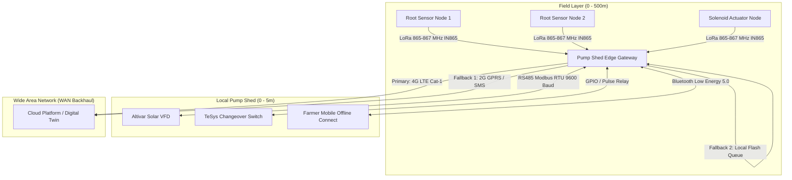

# 04 Wireless Connectivity, Offline Protocols & Telemetry

**Document Code:** TECH-CONN-04  
**Domain:** Rural Networking, RF Engineering & Offline-First Data Protocols  

---

## 1. Network Topology: Multi-Tier Hybrid Architecture

Because in-field wireless conditions in rural India are characterized by high attenuation, foliage obstruction, and frequent cellular outages, a single wireless protocol cannot handle both sensor nodes and cloud backhaul. A tiered hybrid topology is implemented:

---

## 2. Wireless Protocol Selection Matrix

| Protocol | Frequency Band | Range in Farm | Power Consumption | Hardware Unit Cost | Suitability in Indian Agri Context |
|---|---|:---:|:---:|:---:|---|
| **LoRa (IN865)** | **865–867 MHz** (De-licensed India band) | **1.5 – 3.0 km** through dense sugarcane/canopy | Ultra-low (<15mA TX, <5uA sleep) | ~₹450 (SX1262) | **Optimal for Field Sensing:** Sub-GHz penetrates vegetation easily; unlicensed band; zero recurring SIM cost for sensors. |
| **BLE 5.0** | 2.4 GHz | 10 – 30 meters | Low | Embedded in ESP32 (₹0) | **Optimal for Local Diagnostics:** Allows farmer to configure and view status directly on phone without cellular signal. |
| **4G LTE Cat-1** | Band 1, 3, 5, 8, 40, 41 | Cell tower range (5–15 km) | Medium (peak 500mA TX) | ~₹1,100 (SIM7600) | **Optimal for Gateway Backhaul:** Wide rural coverage; lower cost and power than Cat-4 LTE; supported by Airtel/Jio/Vi. |
| **2G GPRS / SMS** | 900 / 1800 MHz | Cell tower range | Low | Included in module | **Vital Fallback:** When 4G drops, system sends compact 140-character SMS telemetry or IVR alerts. |

---

## 3. Offline-First Resilience & Resilient Telemetry

1. **Local Persistent Storage Buffer:**
   - The edge gateway incorporates on-board SPI Flash storage (or micro-SD) with a circular FIFO queue.
   - If cellular connectivity drops, sensor telemetry, pump logs, and valve events are timestamped and committed to the local queue.
   - The queue can store up to **90 days of complete continuous operational logs** locally.
   - Upon network reconnection, data is uploaded in compressed batches using gzip/MessagePack over MQTT.
2. **Autonomous Offline Closed-Loop Rule:**
   - **Zero Cloud Dependency for Core Operations:** Pumping and load-diversion decisions do NOT wait for cloud authorization. The edge microcontroller executes the local FAO-56 irrigation and surplus power routing algorithm autonomously based on direct sensor readings and local real-time clock (RTC).
   - If the cloud server is completely destroyed, the farm continues to irrigate and cool produce normally.
