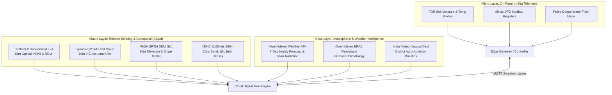

# 05 Data Sources, Satellites & Micro-Meteorology

**Document Code:** TECH-DATA-05  
**Domain:** Earth Observation, Weather APIs, Agronomic Soil Databases & Hydrology Portals  

---

## 1. Multi-Scale Data Ingestion Architecture

---

## 2. Ingested Datasets Specification Matrix

| Dataset / API | Provider / Organization | Spatial Resolution | Temporal Frequency | Extracted Parameters | Mission Role |
|---|---|:---:|:---:|---|---|
| **Sentinel-2 L2A** | ESA / Copernicus | **10 meters** | 5 days | B2 (Blue), B4 (Red), B8 (NIR), B11 (SWIR). Computes **NDVI** (crop vigor) & **NDWI** (canopy moisture). | Macro verification of crop health and drought stress. |
| **Open-Meteo API** | Open-Meteo GmbH (Global) | **0.1° (~11 km)** | Hourly / Daily | Temperature, Relative Humidity, Wind Speed at 2m, Surface Solar Radiation ($R_n$), Precipitation. | Direct input to FAO-56 Penman-Monteith $ET_0$ calculation. |
| **Dynamic World** | Google / WRI | **10 meters** | Near real-time | Probabilities across 9 classes: crops, water, trees, bare ground, built. | Boundary crop classification and land-use tracking. |
| **SRTM DEM GL1** | USGS / NASA | **30 meters** | Static | Elevation ($m$), Surface Slope (%), Watershed Basin Flow Paths. | Micro-topography analysis for gravity drainage and flood runoff risk. |
| **ISRIC SoilGrids** | International Soil Reference Centre | **250 meters** | Static (Global) | Sand (%), Silt (%), Clay (%), Bulk Density, pH, Cation Exchange Capacity. | Parameterizes soil Field Capacity ($\theta_{FC}$) and Wilting Point ($\theta_{PWP}$) when site soil tests are missing. |
| **CGWB National Aquifer Portal** | Central Ground Water Board (India) | Block / Taluk level | Annual / Seasonal | Depth to water table ($m$), Aquifer category (Safe, Semi-Critical, Over-Exploited). | Enforces regional groundwater withdrawal quotas. |
