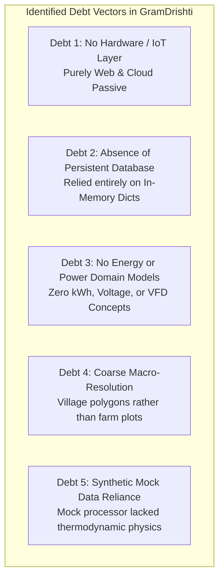

# 03 Technical Debt & Architecture Limitations of Old Work

**Document Code:** TECH-DEBT-03  
**Domain:** Codebase Vulnerability Analysis & Structural Bottlenecks  

---

## 1. Technical Debt Audit: GramDrishti

### Granular Technical Debt Analysis:
1. **Total Absence of Industrial Energy & Power Interfaces:**
   - GramDrishti was designed as an environmental and governance dashboard. It contained zero concepts of kilowatt-hours, power factor, solar inverter DC bus voltage, or motor load. Presenting it to Schneider Electric without an energy engine would result in immediate dismissal.
2. **In-Memory Volatile Storage Model:**
   - GramDrishti relied on in-memory Python dictionaries (`SEARCH_CACHE`, `BOUNDARY_CACHE`). A server restart completely purged cached computations. For a farm platform tracking multi-week cumulative soil water depletion and seasonal energy billing, persistent storage (PostgreSQL/SQLite) is mandatory.
3. **Absence of Real-Time Actuation / Control Loop:**
   - GramDrishti was purely an observational reporting tool. It could not send control signals (open valve, start pump, change VFD speed).
4. **Mock Data Without Physical Grounding:**
   - GramDrishti's `MOCK_METRICS` dictionary used static lookup tables for 5 villages. It did not model real dynamic differential equations (e.g., soil matric suction vs. water depletion rate).

---

## 2. Technical Debt Remediation Blueprint

| Debt Vector | Remediation Strategy in Proposed Solution |
|---|---|
| No Energy Model | Build an **Energy-Water Nexus Module** tracking solar PV generation curves ($P = I \times V$), pump motor efficiency ($\eta$), and diverted cooling energy ($kWh$). |
| No Hardware Interfaces | Implement a simulated **RS485 Modbus RTU interface** and MQTT telemetry broker representing Altivar VFD registers. |
| In-Memory Cache Volatility | Implement a structured lightweight database schema (SQLite for edge / PostgreSQL for cloud digital twin) with time-series logging. |
| Static Mocking | Replace static arrays with a real-time **Dynamic Physical Simulator** running numerical integration of solar irradiance, motor hydraulics, and FAO-56 soil depletion. |
