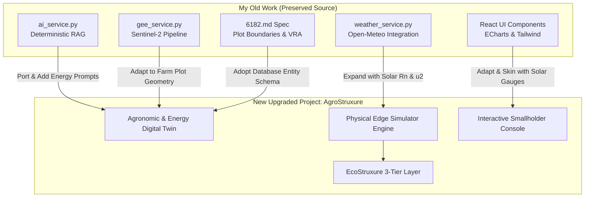

# 04 Migration Opportunities & Code Reuse Roadmap

**Document Code:** MIGRATE-04  
**Domain:** Code Refactoring, Asset Porting & Component Integration  

---

## 1. Migration Strategy: Evolution, Not Overwrite

The original codebase in `My Old Work` remains 100% untouched and preserved as an intellectual archive. A clean architectural migration bridges the best algorithms into the new energy-centric solution:

---

## 2. Step-by-Step Code Migration Plan

1. **Phase A: Extract Geospatial & Weather Engines**
   - Copy `backend/services/weather_service.py` to the new service package.
   - Add hourly solar radiation ($R_n$ in $\text{W/m}^2$) and wind speed ($u_2$) extraction from the Open-Meteo response.
   - Refactor `backend/services/gee_service.py` to accept arbitrary polygon bounding coordinates from user-drawn farm plots.
2. **Phase B: Port and Refactor the Deterministic RAG Pipeline**
   - Adapt `backend/services/ai_service.py` to handle energy, pumping, and cold-storage intents.
   - Rewrite system prompts to enforce strict mathematical bounding on irrigation advice.
3. **Phase C: Adopt Plot Entity Models from 6182.md**
   - Utilize the field boundary, soil classification, and crop lifecycle data models defined in `other work/references/6182.md` to establish a relational schema.
4. **Phase D: Construct the New Energy-Water Physics Engine**
   - Implement the mathematical models for FAO-56 $ET_0$, soil depletion, pump motor hydraulics, and solar load diversion.
