```mermaid
flowchart TD
    subgraph GD["D:\\Projects\\GramDrishti (Governance & Intelligence)"]
        GD_RAG["Deterministic Agentic RAG<br/>(backend/app/services/ai/)"]
        GD_SCHEME["Government Schemes Engine<br/>(backend/app/services/ai/processors/schemes.py)"]
        GD_PDF["ReportLab PDF Generator<br/>(backend/app/services/reports/pdf_generator.py)"]
        GD_I18N["Tri-Lingual Localization<br/>(frontend/src/locales/ en, hi, mr)"]
        GD_CHARTS["ECharts Visualization Suite<br/>(frontend/src/components/charts/)"]
        GD_CACHE["Pre-Cached Demo Presets<br/>(scripts/demo_setup.py & processor.py)"]
    end

    subgraph PR["D:\\Projects\\Pragya (Precision Agronomy & Satellites)"]
        PR_SAR["Sentinel-1 SAR Radar Pipeline<br/>(internal/pipeline/radar_indices.go)"]
        PR_OPT["Sentinel-2 Optical 10m Grid<br/>(internal/pipeline/sentinel2.go & grid.go)"]
        PR_ONB["8-Step Farmer Wizard<br/>(frontend/src/pages/steps/Step6_Irrigation.jsx)"]
        PR_MAP["Leaflet Map & HeatmapLayer<br/>(frontend/src/components/map/)"]
        PR_DB["PostGIS Spatial Schema<br/>(migrations/00001 - 00043)"]
        PR_CHAT["Krishi Mitra Prompt Guard<br/>(internal/chatbot/prompt.go)"]
    end

    subgraph AS["AgroStruxure™ Architecture (Yuva Yodha 2026)"]
        AS_TIER3["Tier 3: Apps & Analytics<br/>• Vernacular Dashboard (EN/HI/MR)<br/>• Farm Health & Energy Audit Report (PDF)<br/>• Grounded Krishi Mitra Copilot"]
        AS_TIER2["Tier 2: Edge Control (Schneider EcoStruxure™)<br/>• FAO-56 Penman-Monteith Water Balance<br/>• Solar Surplus Load Diverter to Cold Storage<br/>• Modbus RTU / MQTT to Altivar ATV320 & TeSys"]
        AS_TIER1["Tier 1: Connected Products & Sensors<br/>• Sentinel-1 SAR Cloud-Free Soil Moisture (SMI)<br/>• Sentinel-2 10m Optical Vegetation Indices<br/>• Soil FDR Capacitive Probes & Smart Water Meter"]
    end

    PR_SAR --> AS_TIER1
    PR_OPT --> AS_TIER1
    GD_RAG --> AS_TIER3
    GD_SCHEME --> AS_TIER3
    GD_PDF --> AS_TIER3
    GD_I18N --> AS_TIER3
    GD_CHARTS --> AS_TIER3
    PR_ONB --> AS_TIER3
    PR_MAP --> AS_TIER3
    PR_DB --> AS_TIER2
    PR_CHAT --> AS_TIER3
    GD_CACHE --> AS_TIER3
```

# Master Reusable Asset & Deep Harvest Guide: Pragya & GramDrishti
**Document Code:** HARVEST-PRAGYA-GD-01  
**Project Context:** Yuva Yodha Energy Tech Hackathon 2026 — Track 01: Sustainable Agriculture (Energy, Water & Productivity)  
**Host Sponsor:** Schneider Electric India  
**Target Solution:** AgroStruxure™  
**Author:** Technical Architecture & Research Team  
**Date:** October 2026  

---

## Executive Summary & Research Value Assessment

Over months of intense research and engineering, extensive technical infrastructure has been developed across two primary repositories:
1. **`D:\Projects\Pragya` (MindstriX / Global Farmer Platform)**: A high-concurrency Go (Gin) and React 19 geospatial agronomy system featuring dual-mode optical (Sentinel-2) and synthetic aperture radar (Sentinel-1 SAR) pipelines, 10m Gaussian spatial grid smoothing, 43 PostGIS migrations with Row-Level Security (RLS), and an 8-step farmer onboarding wizard.
2. **`D:\Projects\GramDrishti`**: A Geographic Decision Support System (GDSS) built on FastAPI (Python) and React 18/TypeScript with zero-hallucination agentic RAG, dynamic ReportLab PDF audit card generation, automated government scheme matching (PMKSY, Soil Health Card), tri-lingual localization (English, Hindi, Marathi), and sub-2-second demo pre-caching.

This document serves as the **definitive, code-level harvest blueprint**. It details every reusable module, function, mathematical model, UI component, and database migration, with exact instructions on how to integrate them into **AgroStruxure™** for the Schneider Electric Hackathon.

---



---

## 1. Deep Dive: Assets to Harvest from `D:\Projects\Pragya`

### 1.1 Sentinel-1 SAR Radar Pipeline (Cloud-Penetrating Soil Moisture)
During the Indian Kharif (monsoon) season, cloud cover renders optical satellites like Sentinel-2 completely unusable for weeks. `Pragya` contains a fully functional, mathematically rigorous Sentinel-1 Synthetic Aperture Radar (SAR) processing pipeline that penetrates clouds, rain, and nighttime conditions to deliver 10m soil moisture estimates.

* **Primary Source Files:**
  - [`radar_indices.go`](file:///D:/Projects/Pragya/internal/pipeline/radar_indices.go)
  - [`radar_grid.go`](file:///D:/Projects/Pragya/internal/pipeline/radar_grid.go)
  - [`sentinel1.go`](file:///D:/Projects/Pragya/internal/pipeline/sentinel1.go)
* **Harvestable Mathematical Implementations:**
  1. **Soil Moisture Index (SMI):**
     $$\text{SMI} = \frac{VV - VV_{dry}}{VV_{wet} - VV_{dry}} \quad \in [0, 1]$$
     Configured with calibrated dry/wet backscatter thresholds ($VV_{dry} = -20\text{ dB}$, $VV_{wet} = -8\text{ dB}$ for Indian soils). Higher values indicate higher volumetric water content.
  2. **Radar Vegetation Index (RVI):**
     Converts decibel backscatter to linear power $\text{linear} = 10^{(\text{dB} / 10)}$ and evaluates:
     $$\text{RVI} = \frac{4 \cdot VH_{lin}}{VV_{lin} + VH_{lin}} \quad \in [0, 1]$$
  3. **Polarimetric Ratio:**
     $$\text{RATIO} = VV_{\text{dB}} - VH_{\text{dB}}$$
* **How to Adapt for AgroStruxure™:**
  Use the SMI output as the satellite-derived soil moisture anchor. When physical soil FDR sensors are dry or missing, the SMI acts as the failover ground-truth soil moisture estimate to prevent over-irrigation.

---

### 1.2 Sentinel-2 Optical Remote Sensing & Cloud-Free Compositing
* **Primary Source Files:**
  - [`indices.go`](file:///D:/Projects/Pragya/internal/pipeline/indices.go)
  - [`sentinel2.go`](file:///D:/Projects/Pragya/internal/pipeline/sentinel2.go)
  - [`grid.go`](file:///D:/Projects/Pragya/internal/pipeline/grid.go)
  - [`smooth.go`](file:///D:/Projects/Pragya/internal/pipeline/smooth.go)
  - [`client.go`](file:///D:/Projects/Pragya/internal/gee/client.go)
* **Harvestable Engineering Features:**
  1. **Safe-Divide Guard ($10^{-6}$ epsilon):**
     Prevents float divide-by-zero or negative denominator errors in high-blue/haze pixels (e.g. in EVI and NDRE calculations).
  2. **10 Agricultural Indices Implemented:**
     - **NDVI** (Normalized Difference Vegetation Index): General canopy vigor and biomass.
     - **NDMI** (Normalized Difference Moisture Index): Plant canopy water stress.
     - **EVI** (Enhanced Vegetation Index): High-biomass regions without saturation.
     - **NDRE** (Normalized Difference Red Edge): Chlorophyll content and nitrogen uptake.
     - **RECI** (Red Edge Chlorophyll Index).
     - **MSAVI** (Modified Soil Adjusted Vegetation Index): Early-stage growth before canopy closure.
     - **SAVI**, **NDWI**, **GNDVI**, and **CVI**.
  3. **10m Spatial Grid & Gaussian Smoothing:**
     Transforms discrete vector sample points across a farmer's plot into a continuous, visually stunning interpolated raster heatmap for the frontend map.

---

### 1.3 8-Step Farmer Onboarding & Cadastral Plot Profiler
* **Primary Source Files:**
  - [`Step1_BasicDetails.jsx`](file:///D:/Projects/Pragya/frontend/src/pages/steps/Step1_BasicDetails.jsx)
  - [`Step2_Location.jsx`](file:///D:/Projects/Pragya/frontend/src/pages/steps/Step2_Location.jsx)
  - [`Step3_FarmDetails.jsx`](file:///D:/Projects/Pragya/frontend/src/pages/steps/Step3_FarmDetails.jsx)
  - [`Step4_MapSelection.jsx`](file:///D:/Projects/Pragya/frontend/src/pages/steps/Step4_MapSelection.jsx)
  - [`Step5_CropInfo.jsx`](file:///D:/Projects/Pragya/frontend/src/pages/steps/Step5_CropInfo.jsx)
  - [`Step6_Irrigation.jsx`](file:///D:/Projects/Pragya/frontend/src/pages/steps/Step6_Irrigation.jsx)
  - [`Step7_Soil.jsx`](file:///D:/Projects/Pragya/frontend/src/pages/steps/Step7_Soil.jsx)
  - [`Step8_Consent.jsx`](file:///D:/Projects/Pragya/frontend/src/pages/steps/Step8_Consent.jsx)
* **Direct Value for Hackathon Submission:**
  - **Step 6 (Irrigation System Profiling):** Captures pump source (borewell, canal, river) and irrigation method (drip, sprinkler, flood). Directly add an option for *"Solar Powered (PM-KUSUM) + Schneider Altivar VFD"*.
  - **Step 7 (Soil Profile):** Captures soil type (Sandy, Loam, Clay, Black Cotton Soil). This directly determines the **Field Capacity ($FC$)** and **Permanent Wilting Point ($PWP$)** constants required by the FAO-56 irrigation algorithm.
  - **Step 8 (DPDP Act Compliance):** Implements statutory consent mechanisms required under India's Digital Personal Data Protection Act, providing strong governance marks from judges.

---

### 1.4 Interactive Leaflet Delineation & Heatmap Visualization
* **Primary Source Files:**
  - [`MapView.jsx`](file:///D:/Projects/Pragya/frontend/src/components/map/MapView.jsx)
  - [`HeatmapLayer.jsx`](file:///D:/Projects/Pragya/frontend/src/components/map/HeatmapLayer.jsx)
  - [`MapInputModal.jsx`](file:///D:/Projects/Pragya/frontend/src/components/map/MapInputModal.jsx)
  - [`TimelineBar.jsx`](file:///D:/Projects/Pragya/frontend/src/components/map/TimelineBar.jsx)
  - [`Legend.jsx`](file:///D:/Projects/Pragya/frontend/src/components/map/Legend.jsx)
  - [`indexColormaps.js`](file:///D:/Projects/Pragya/frontend/src/utils/indexColormaps.js)
* **Harvestable Features:**
  - Fully tuned color ramps for all satellite indices (`NDVI`, `NDMI`, `SMI`, `EVI`).
  - Interactive polygon drawing with geodesic area calculation (hectares/acres).
  - Multi-temporal slider permitting historical backtesting across observation dates.

---

### 1.5 Hardened Database Architecture (PostGIS Migrations)
* **Primary Source Files:**
  - [`00001_schema_and_roles.sql`](file:///D:/Projects/Pragya/migrations/00001_schema_and_roles.sql) to [`00043_offline_operations_actor.sql`](file:///D:/Projects/Pragya/migrations/00043_offline_operations_actor.sql)
  - [`00015_assets.sql`](file:///D:/Projects/Pragya/migrations/00015_assets.sql) (Machinery, pumps, and energy assets)
  - [`00028_p3_farms_fields.sql`](file:///D:/Projects/Pragya/migrations/00028_p3_farms_fields.sql) (Cadastral boundaries)
  - [`00036_p3_seasons_crop_cycles.sql`](file:///D:/Projects/Pragya/migrations/00036_p3_seasons_crop_cycles.sql) (Crop growth stages)
  - [`00038_p3_soil_tests_invariants.sql`](file:///D:/Projects/Pragya/migrations/00038_p3_soil_tests_invariants.sql)
* **Harvestable Schemas:**
  - **Asset Registry:** Directly stores Schneider Altivar ATV320 VFD serials, solar array ratings ($kW_p$), pump ratings ($HP$), and cold room thermal storage capacity ($m^3$).
  - **Crop Cycles:** Tracks sowing date, emergence, mid-season, and senescence to dynamically adjust crop coefficient ($K_c$) over time.

---

## 2. Deep Dive: Assets to Harvest from `D:\Projects\GramDrishti`

### 2.1 Zero-Hallucination Agentic RAG Architecture
* **Primary Source Files:**
  - [`ai_service.py`](file:///D:/Projects/GramDrishti/backend/app/services/ai/ai_service.py)
  - [`prompt_builder.py`](file:///D:/Projects/GramDrishti/backend/app/services/ai/prompt_builder.py)
  - [`classifier.py`](file:///D:/Projects/GramDrishti/backend/app/services/ai/classifier.py)
  - [`agriculture.py`](file:///D:/Projects/GramDrishti/backend/app/services/ai/processors/agriculture.py)
  - [`water.py`](file:///D:/Projects/GramDrishti/backend/app/services/ai/processors/water.py)
* **Harvestable Pattern:**
  - **Decoupled Architecture:** Heavy mathematical computation is executed deterministically in Python/Go *before* invoking the LLM. The LLM receives structured JSON metrics and cannot invent arbitrary figures.
  - **Enforced Reasoning Contract:**
    $$\text{Evidence} \longrightarrow \text{Physical Reasoning} \longrightarrow \text{Actionable Recommendation} \longrightarrow \text{Impact Quantification}$$
  - **Bidirectional UI Dispatch (`actions_array`):** The AI response includes executable frontend hooks (e.g., automatically switching map layers or toggling cold storage load views based on conversation topics).

---

### 2.2 Government Scheme Matching Engine
* **Primary Source File:**
  - [`schemes.py`](file:///D:/Projects/GramDrishti/backend/app/services/ai/processors/schemes.py)
* **Harvestable Logic:**
  - Automated rule engine that detects water and vegetation deficits and matches farmers to state and national programs:
    - **PMKSY (Per Drop More Crop):** Micro-irrigation subsidies (up to 55% for smallholders).
    - **Soil Health Card Scheme:** Soil nutrient testing and replenishment.
  - **Immediate Expansion for AgroStruxure™:**
    - **PM-KUSUM Component B:** Standalone solar pump subsidy (up to 60% combined Central + State).
    - **PM-KUSUM Component C:** Individual pump solarization with net metering.
    - **Agriculture Infrastructure Fund (AIF):** 3% interest subvention for on-farm micro-cold storage rooms.

---

### 2.3 Production ReportLab PDF Generation Engine
* **Primary Source File:**
  - [`pdf_generator.py`](file:///D:/Projects/GramDrishti/backend/app/services/reports/pdf_generator.py)
* **Harvestable Code:**
  - High-quality XML-safe PDF builder (`sanitize_text_for_pdf`) that handles markdown bold/italic parsing, tabular formatting, dynamic color badges, and multi-page layouts.
  - **Conversion Target:** Repurpose into the official **"AgroStruxure™ Farm Energy & Water Audit Report"**, outputting:
    - Total groundwater volume conserved ($m^3$).
    - Total solar pumping energy consumed ($kWh$).
    - Surplus solar energy redirected to cold storage ($kWh$).
    - Perishable crop spoilage avoided (metric tonnes) and income uplift (₹).

---

### 2.4 Tri-Lingual Localization System (i18n)
* **Primary Source Files:**
  - [`en/common.json`](file:///D:/Projects/GramDrishti/frontend/src/locales/en/common.json)
  - [`hi/common.json`](file:///D:/Projects/GramDrishti/frontend/src/locales/hi/common.json)
  - [`mr/common.json`](file:///D:/Projects/GramDrishti/frontend/src/locales/mr/common.json)
  - [`LanguageSwitcher.tsx`](file:///D:/Projects/GramDrishti/frontend/src/components/layout/LanguageSwitcher.tsx)
* **Harvestable Assets:**
  - Complete, rural-validated translation dictionaries in **English, Hindi, and Marathi**.
  - Covers key terms for irrigation, water levels, solar power, seasonal trends, and agricultural recommendations.

---

### 2.5 Apache ECharts Visual Analytics Suite
* **Primary Source Files:**
  - [`NDVITrendChart.tsx`](file:///D:/Projects/GramDrishti/frontend/src/components/charts/NDVITrendChart.tsx)
  - [`WaterTrendChart.tsx`](file:///D:/Projects/GramDrishti/frontend/src/components/charts/WaterTrendChart.tsx)
  - [`MultiPillarRadarChart.tsx`](file:///D:/Projects/GramDrishti/frontend/src/components/charts/MultiPillarRadarChart.tsx)
  - [`TemperatureTrendChart.tsx`](file:///D:/Projects/GramDrishti/frontend/src/components/charts/TemperatureTrendChart.tsx)
* **Direct Adaptations for Hackathon Visuals:**
  - **Dual-Axis Power vs. Moisture Chart:**
    - Axis 1: Solar PV output ($kW$) and VFD pump load ($kW$).
    - Axis 2: Root-zone soil moisture ($FC$ vs. current soil moisture).
  - **Multi-Pillar Sustainability Radar Chart:**
    - Pillars: Water Conservation, Solar Self-Consumption, Post-Harvest Cold Room Uptime, Carbon Avoidance, and Farmer ROI.

---

### 2.6 Demo Reliability & Pre-Caching Architecture
* **Primary Source Files:**
  - [`demo_setup.py`](file:///D:/Projects/GramDrishti/scripts/demo_setup.py)
  - `MOCK_METRICS` in [`processor.py`](file:///D:/Projects/GramDrishti/backend/app/services/gee/processor.py#L22-L80)
* **Value:**
  - During live presentations, remote satellite API calls (Google Earth Engine) can take 30–60 seconds or fail due to rate limits.
  - The deterministic pre-caching mechanism guarantees instantaneous (<1.5s) loading of live demonstration plots (e.g. Pune/Nashik agricultural plots) under zero or flaky internet conditions.

---

## 3. The Harvest Blueprint: Step-by-Step Integration

```
┌──────────────────────────────────────────────────────────────────────────────────┐
│                         AGROSTRUXURE™ HARVEST MAPPING                            │
├──────────────────────┬───────────────────────────────┬───────────────────────────┤
│ Target Component     │ Source Codebase & Path        │ Action Required           │
├──────────────────────┼───────────────────────────────┼───────────────────────────┤
│ 1. Cloud-Free Ground │ `Pragya/internal/pipeline/`   │ Extract SMI radar math;   │
│    Moisture (SAR)    │ `radar_indices.go`            │ integrate into root-zone  │
│                      │                               │ water balance equation.   │
├──────────────────────┼───────────────────────────────┼───────────────────────────┤
│ 2. Plot Heatmaps &   │ `Pragya/internal/pipeline/`   │ Reuse Gaussian smoothing  │
│    Grid Reducer      │ `grid.go`, `smooth.go`        │ and 10m raster generation.│
├──────────────────────┼───────────────────────────────┼───────────────────────────┤
│ 3. Farmer Plot Setup │ `Pragya/frontend/src/pages/`  │ Keep steps 1-8; add solar │
│    & Irrigation Form │ `steps/Step6_Irrigation.jsx`  │ pump & cold storage type. │
├──────────────────────┼───────────────────────────────┼───────────────────────────┤
│ 4. Deterministic     │ `GramDrishti/backend/app/`    │ Repoint prompt builder to │
│    Agronomy Copilot  │ `services/ai/prompt_builder`  │ VFD power & moisture data.│
├──────────────────────┼───────────────────────────────┼───────────────────────────┤
│ 5. Government Scheme │ `GramDrishti/backend/app/`    │ Add PM-KUSUM Component B │
│    Matching Engine   │ `services/ai/processors/`     │ and AIF Cold Room rules.  │
├──────────────────────┼───────────────────────────────┼───────────────────────────┤
│ 6. Energy & Water    │ `GramDrishti/backend/app/`    │ Format tables for kWh     │
│    Audit Report      │ `services/reports/pdf_...`    │ diverted and m³ saved.    │
├──────────────────────┼───────────────────────────────┼───────────────────────────┤
│ 7. Vernacular UI     │ `GramDrishti/frontend/src/`   │ Reuse EN/HI/MR JSON keys; │
│    Localization      │ `locales/` (en, hi, mr)       │ add solar/VFD terminology.│
├──────────────────────┼───────────────────────────────┼───────────────────────────┤
│ 8. Solar/Pump Load   │ `GramDrishti/frontend/src/`   │ Plot PV generation curve  │
│    ECharts Visualizer│ `components/charts/`          │ vs. cold room diversion.  │
└──────────────────────┴───────────────────────────────┴───────────────────────────┘
```

---

## 4. Components to Exclude (Preventing Dead Weight)

To ensure the hackathon pitch remains razor-sharp and tightly aligned with Schneider Electric's Challenge 01 rubric, the following components should **NOT** be ported:

1. **Macro Gram Panchayat Boundary Shp/GeoJSONs (`GramDrishti/backend/data/`):**
   - *Reason:* Village-wide aggregate averages do not optimize individual solar pump operations or farmer-level VFD switchgear.
2. **Gram-Level Flood & Topographic DEM Runoff Models (`GramDrishti`):**
   - *Reason:* Disaster hazard mitigation is outside the scope of solar irrigation and cold-chain productivity.
3. **Heavy Three.js 3D Diorama Landing Scene (`Pragya/frontend/src/components/3d/`):**
   - *Reason:* While visually impressive, heavy 3D canvases increase initial page weight and can lag during live laptop presentations. Clean Leaflet maps and interactive ECharts charts are preferred.
4. **43-Migration Full Enterprise Stack for Local Demo (`Pragya`):**
   - *Reason:* Running PostgreSQL 16 + PostGIS + Redis + Fake-GCS + Firebase Emulators creates unnecessary operational complexity for a 5-minute hackathon demo. Use a clean FastAPI/Python or Go single-binary backend with SQLite/in-memory cache for the prototype presentation.

---

## 5. Conclusion & Immediate Execution Path

By taking the **Sentinel-1 SAR radar and cadastral mapping from `Pragya`** and combining them with the **deterministic RAG, scheme matcher, PDF audit generator, and multilingual UI from `GramDrishti`**, you have already completed the vast majority of the core software stack.

The primary net-new code required for the hackathon is solely the **AgroStruxure™ Edge Dispatch Logic**:
- Integrating the **FAO-56 Penman-Monteith Evapotranspiration ($ET_0$)** formula using hourly weather data.
- The **Solar Surplus Diversion Algorithm** that commands the virtual Schneider Altivar Solar ATV320 VFD and TeSys contactors to redirect surplus power to micro-cold storage once soil moisture reaches Field Capacity.
