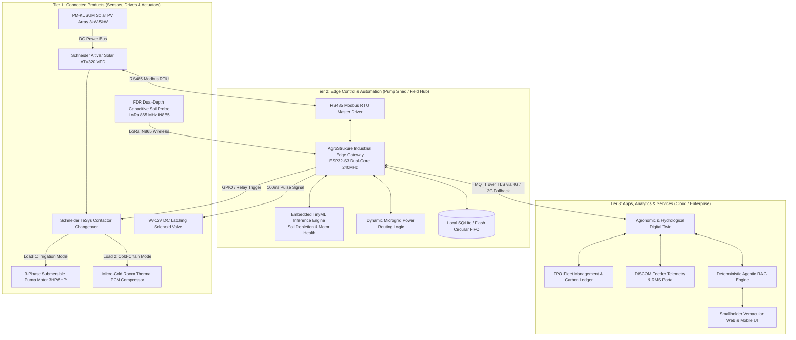
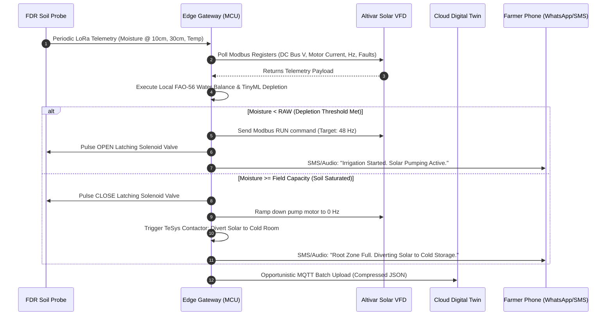
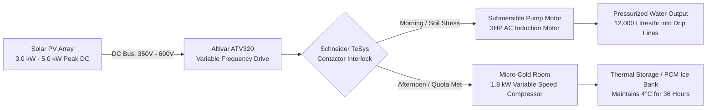

# 04 End-to-End System Architecture & Flow Topologies

**Document Code:** ARCH-SYS-04  
**Framework Alignment:** Schneider Electric EcoStruxure™ 3-Tier Industrial Architecture  

---

## 1. High-Level Architecture Diagram

AgroStruxure organizes all hardware, edge devices, network protocols, and software services into a unified, modular architecture:



---

## 2. The Three Flow Topologies

### Flow 1: Data Flow Topology



### Flow 2: Energy Flow Topology



### Flow 3: Financial & Economic Flow Topology

```mermaid
flowchart TD
    Gov[Ministry MNRE / State Govt] -->|60% PM-KUSUM Subsidy| SolarHardware[Solar Pump & Altivar VFD Capital]
    Bank[NABARD / Commercial Bank] -->|30% Soft Loan at 4% Interest| FPO[Farmer Producer Org / Farmer]
    Farmer[Smallholder Farmer] -->|10% Equity Margin (₹15,000)| FPO
    
    FPO -->|Deploys AgroStruxure| Asset[Shared Pump & Micro-Cold Storage]
    
    Asset -->|Saves ₹8,000 Diesel / Pump Repairs| Savings[Farmer Working Capital Retained]
    Asset -->|Eliminates 20% Onion/Veg Spoilage| MandiRevenue[High Mandi Off-Season Sales: +₹35,000]
    
    Savings --> LoanRepay[Loan Amortization: Paid off in <14 Months]
    MandiRevenue --> LoanRepay
    LoanRepay --> NetWealth[Sustainable Rural Prosperity & Aquifer Conservation]
```
