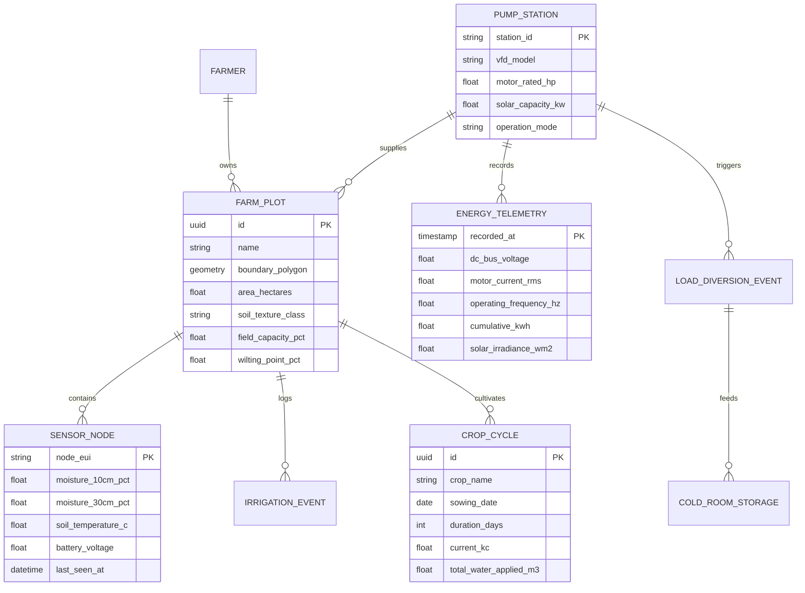

# 05 Data Architecture, Entity Schemas & API Contracts

**Document Code:** ARCH-DATA-05  
**Domain:** Relational Schemas, Time-Series Telemetry, Modbus Maps & MQTT Topics  

---

## 1. Entity-Relationship Data Model

The data architecture is structured for fast relational aggregation and high-throughput time-series logging:



---

## 2. Real-Time MQTT Telemetry Topic Hierarchy

The edge gateway communicates with the cloud backend over a structured MQTT hierarchy using TLS 1.3:

* `agrostruxure/v1/{tenant_id}/{station_id}/telemetry/soil`
  ```json
  {
    "timestamp": 1727856000,
    "node_id": "SN-IN865-042",
    "moisture_10cm": 41.2,
    "moisture_30cm": 44.8,
    "temperature_c": 28.4,
    "battery_v": 3.28
  }
  ```
* `agrostruxure/v1/{tenant_id}/{station_id}/telemetry/energy`
  ```json
  {
    "timestamp": 1727856000,
    "dc_voltage": 542.1,
    "motor_current": 7.42,
    "freq_hz": 47.8,
    "active_load": "PUMP_IRRIGATION",
    "diverted_cold_storage_kw": 0.0,
    "cumulative_kwh": 142.85
  }
  ```
* `agrostruxure/v1/{tenant_id}/{station_id}/command/actuate`
  ```json
  {
    "command_id": "cmd-8941",
    "target": "LOAD_SWITCH",
    "action": "ROUTE_TO_COLD_ROOM",
    "manual_override_flag": false,
    "timestamp": 1727856005
  }
  ```

---

## 3. Industrial Modbus RTU Register Mapping (Altivar Solar ATV320)

| Register Address | Data Type | Units | Access | Description |
|---|---|---|:---:|---|
| `3201` | INT16 (Signed) | $0.1\text{ Hz}$ | Read | Output Motor Operating Frequency |
| `3202` | UINT16 | $0.1\text{ A}$ | Read | Motor RMS Current per Phase |
| `3203` | UINT16 | $0.1\text{ V}$ | Read | DC Bus Voltage from Solar Array |
| `3204` | UINT16 | % | Read | Motor Thermal State (% of max limit) |
| `3208` | BITFIELD16 | N/A | Read | Drive Status Word (Bit 0: Ready, Bit 2: Running, Bit 3: Fault) |
| `8501` | BITFIELD16 | N/A | Read/Write | Control Command Word (Bit 0: Stop, Bit 1: Run, Bit 7: Reset) |
| `8502` | INT16 | $0.1\text{ Hz}$ | Read/Write | Speed Frequency Reference Target |
