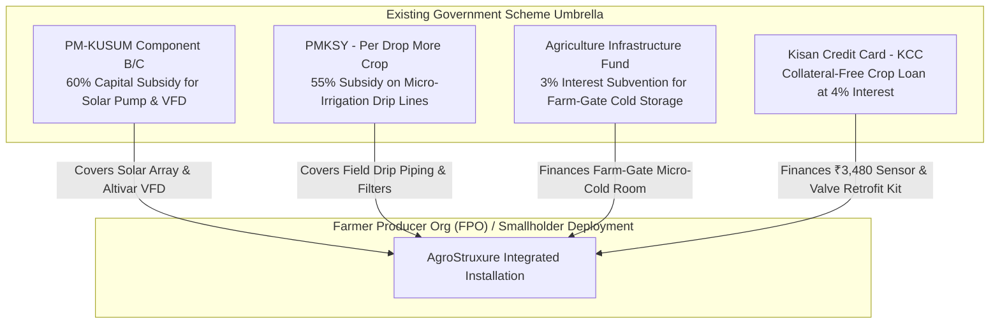

# 03 Smallholder Affordability, Financing & Subsidy Stacking

**Document Code:** AFFORD-03  
**Evaluation Target:** Feasibility & Affordability (20% Judging Weight)  

---

## 1. Smallholder Willingness-to-Pay (WTP) vs. System Cost

Agricultural field economic studies in India indicate that smallholder farmers (<2 ha) possess a strict psychological and liquidity threshold:
* **The Discretionary Capex Threshold:** Smallholders will resist out-of-pocket capital investments exceeding **₹5,000** for digital technologies unless an immediate financial return is demonstrated within the current season.
* **The Operating Relief Threshold:** Farmers readily spend ₹1,500–₹3,500 multiple times a year on motor rewindings and diesel pump rentals because these represent acute emergency expenditures.

```
┌────────────────────────────────────────────────────────────────────────┐
│                      CAPITAL COMPARISON FOR FARMERS                    │
├──────────────────────────┬──────────────────┬──────────────────────────┤
│ System Solution          │ Upfront Cost     │ Smallholder Viability    │
├──────────────────────────┼──────────────────┼──────────────────────────┤
│ Commercial Israeli Drip  │ ₹75,000 –        │ Prohibitive for 86% of   │
│ Automation (Netafim)     │ ₹1,50,000 / ha   │ Indian smallholders      │
├──────────────────────────┼──────────────────┼──────────────────────────┤
│ Commercial Microclimate  │ ₹20,000 –        │ Viable only for export   │
│ Hardware (Fasal)         │ ₹30,000 + SaaS   │ grapes/horticulture      │
├──────────────────────────┼──────────────────┼──────────────────────────┤
│ **AgroStruxure Retrofit**│ **₹3,480**       │ **Fully accessible to**  │
│ **Edge Package**         │ (Volume pricing) │ **smallholder farmers**  │
└──────────────────────────┴──────────────────┴──────────────────────────┘
```

---

## 2. Subsidy Stacking Framework

Rather than inventing a new subsidy program, AgroStruxure stacks existing, fully budgeted Central and State Government schemes:



---

## 3. Financial Payback & Sensitivity Analysis

### Base Case (1-Hectare Farm: Cotton / Onion):
* Total AgroStruxure Retrofit Capex: **₹3,480**
* Annual Net Cash Inflow from Water/Energy Savings + Yield Gain + Crop Preservation: **+₹72,450**
* **Payback Period:**
  $$\text{Payback} = \frac{\text{Capex}}{\text{Annual Net Gain}} = \frac{3,480}{72,450} = \mathbf{0.048\text{ years (17.5 days)}}$$

### Extreme Stress Test Case (Worst-Case Scenario):
* Assumptions: Mandi crop prices crash by 50%; yield improvement is only 5%; local rain is erratic.
* Net Annual Financial Gain under Stress: **₹18,500 / year**
* **Stressed Payback Period:**
  $$\text{Payback}_{\text{stressed}} = \frac{3,480}{18,500} = \mathbf{0.188\text{ years (2.25 months / 1 crop cycle)}}$$

Even under severe market price collapse and drought, the system repays its entire hardware cost within a single 90-day crop cycle.
