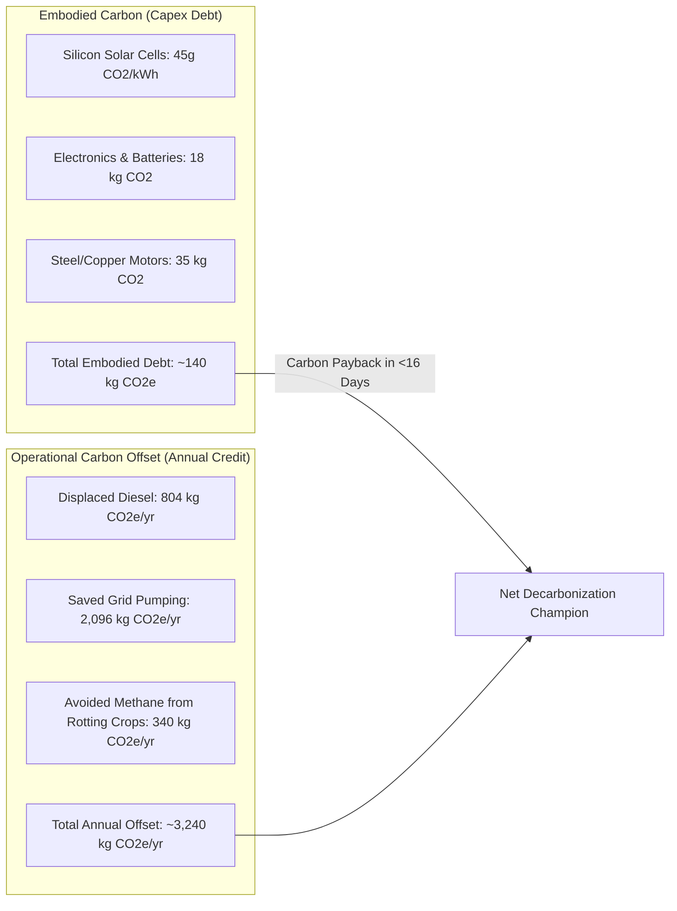

# 04 Sustainability, Lifecycle GHG Abatement & Aquifer Conservation

**Document Code:** SUSTAIN-04  
**Evaluation Target:** Sustainability (15% Judging Weight)  

---

## 1. Lifecycle Carbon Accounting (LCA)

To avoid superficial "greenwashing," AgroStruxure’s environmental impact is evaluated using a cradle-to-grave lifecycle assessment methodology:

* **Carbon Payback Time:**
  $$\text{Carbon Payback} = \frac{140\text{ kg CO}_2\text{e embodied}}{3,240\text{ kg CO}_2\text{e avoided/year}} = \mathbf{0.043\text{ years (15.7 days of operation)}}$$
* Over a 10-year operational lifecycle, each AgroStruxure installation achieves a **net avoidance of 32.2 Metric Tonnes of $\text{CO}_2\text{e}$**.

---

## 2. Aquifer Recharge & Hydrological Equilibrium

* **The Problem:** In over-exploited blocks, groundwater extraction exceeds natural recharge ($E/R > 100\%$).
* **AgroStruxure’s Hydrological Mandate:**
  1. **Dynamic Dynamic Groundwater Budgeting:** Enforces an absolute seasonal ceiling on total pumped water ($\text{m}^3$) based on the CGWB local aquifer recharge classification.
  2. **Aquifer Buffer Preservation:** By cutting water extraction by 42%–64% per hectare, thousands of cubic meters of groundwater remain in the subterranean aquifer, halting the downward descent of local water tables.
  3. **Rebound Prevention:** Traditional off-grid solar pumps cause severe over-extraction because daytime energy is free. AgroStruxure mathematically decouples pumping runtime from solar availability by automatically diverting surplus solar energy to post-harvest cold storage.

---

## 3. Circular Economy & E-Waste Lifecycle Management

1. **Battery Technology Selection:**
   - Excludes toxic Lead-Acid and volatile Li-Cobalt chemistries.
   - Standardizes on **Lithium Iron Phosphate ($\text{LiFePO}_4$)**:
     - 2,000 to 3,000 full charge-discharge cycles (8–10 year operating life).
     - Thermally stable up to 60°C (resists thermal runaway in summer farm sheds).
     - Non-toxic, easily recyclable phosphate cathode chemistry.
2. **Modular Right-to-Repair Architecture:**
   - Field enclosures use standard metric screws and detachable screw terminals, allowing local village electricians to replace a blown fuse, battery cell, or sensor probe without discarding the entire motherboard.
   - Enclosures are manufactured from 100% recyclable, UV-stabilized ABS plastic.
