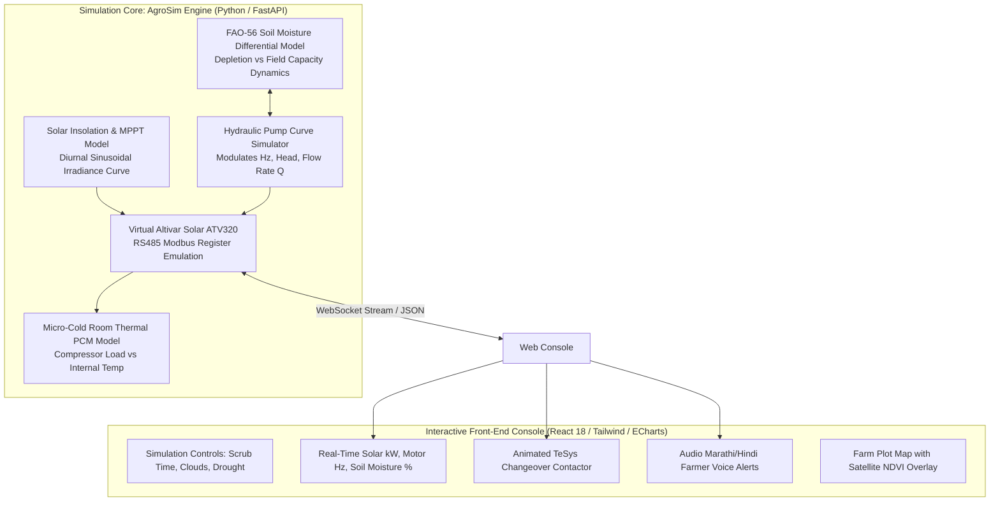

# 01 Prototype Plan, Software Emulation & Hardware-in-the-Loop

**Document Code:** PROTO-PLAN-01  
**Execution Target:** Phase 2 (Prototype & Evaluation — Oct 11 to Nov 22, 2026)  
**Hackathon Rule Reference:** Software prototype or simulation encouraged; no physical build required  

---

## 1. Prototype Strategy: High-Fidelity Hybrid Simulation

Because the official hackathon rules state that *“Teams are not expected to build physical hardware prototypes... Software prototypes, simulation models, wireframes, or data models are fully acceptable,”* our prototype strategy utilizes a **High-Fidelity Software Simulation Engine** paired with an **Interactive Operational Dashboard**:



---

## 2. Technical Stack of the Prototype

| Prototype Layer | Technology Stack | Purpose / Responsibilities |
|---|---|---|
| **Backend Simulator** | Python 3.11, FastAPI, NumPy, SciPy | Mathematical execution of differential equations for soil water depletion, pump affinity curves, and solar irradiance. |
| **Virtual Modbus Broker** | `pymodbus` / Custom Async Modbus Worker | Emulates real Schneider Altivar ATV320 holding registers (`3201` to `3208`), allowing authentic OT-level verification. |
| **Frontend Console** | React 18, Vite, TypeScript, Tailwind CSS, Lucide Icons | Responsive interactive web application for live judge demonstrations. |
| **Data Visualization** | Apache ECharts / Recharts | Synchronized multi-axis charts showing solar generation curve vs. motor load vs. soil moisture tension. |
| **Agentic AI & Voice** | FastAPI Agentic RAG, Web Speech API | Deterministic context generation with Hindi/Marathi audio playback of farmer advisories. |
| **Satellite Integration**| Google Earth Engine API / Sentinel-2 | Plot boundary overlay displaying live NDVI/NDWI vegetative indices. |

---

## 3. Four-Phase Prototype Implementation Roadmap

```
Phase 1: Math Simulation Core (Days 1–5)
├── Implement FAO-56 Penman-Monteith daily/hourly ET0 algorithm
├── Implement centrifugal pump hydraulic affinity curves (f, Q, H, P)
└── Implement virtual Altivar ATV320 register dictionary

Phase 2: Closed-Loop Automation Engine (Days 6–10)
├── Implement soil moisture trigger threshold logic (RAW vs Field Capacity)
├── Implement automated latching solenoid valve pulse state machine
└── Implement dynamic load-diversion switchgear to cold room compressor

Phase 3: Interactive Front-End Console (Days 11–18)
├── Build interactive time-scrubber (Simulate 24-hour day in 60 seconds)
├── Build real-time gauges: Solar Irradiance, Motor Hz, Water Flow, Cold Temp
├── Integrate synchronized ECharts time-series telemetry
└── Integrate multilingual voice playback (Marathi / Hindi / English)

Phase 4: Verification, Hardening & Video Walkthrough (Days 19–25)
├── Run automated test suites verifying edge conditions (cloud transient, dry-run)
├── Record 5-minute high-definition screen demo with narration
└── Deploy containerized prototype on cloud host (Render / Vercel / Railway)
```
