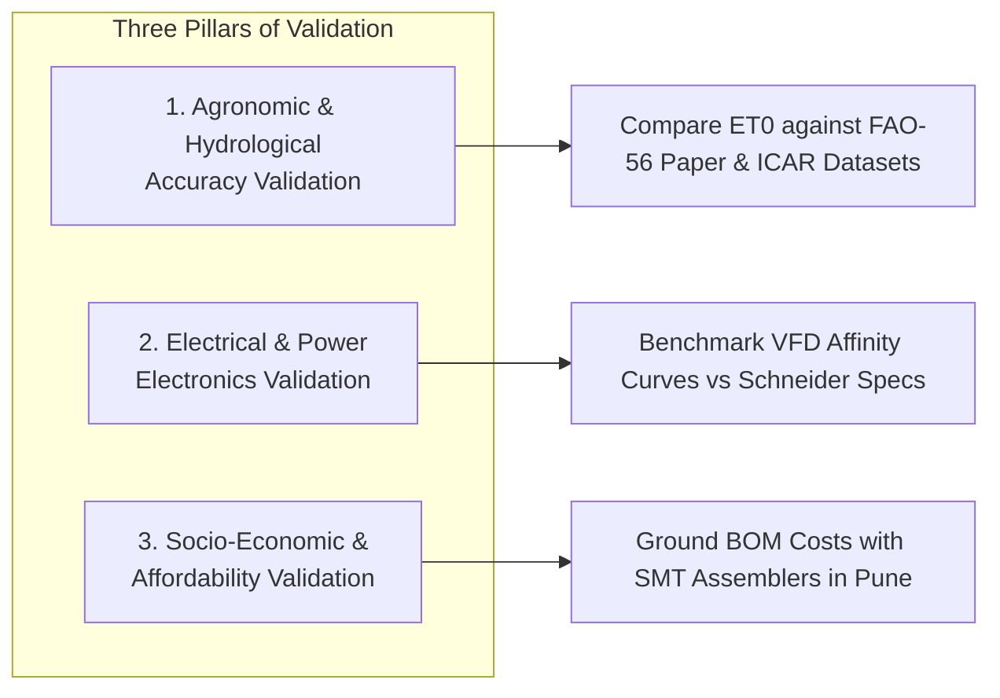

# 04 Technical, Agronomic & Financial Validation Plan

**Document Code:** VALID-PLAN-04  
**Domain:** Empirical Verification, Simulation Benchmarking & Domain Due-Diligence  

---

## 1. Multi-Disciplinary Validation Matrix

---

## 2. Granular Validation Protocols

### Protocol 1: Agronomic Water Balance Validation
* **Methodology:** Compare our Python implementation of FAO-56 Penman-Monteith against the official FAO CROPWAT 8.0 desktop model using identical atmospheric inputs (temperature, humidity, solar radiation, wind speed).
* **Success Criteria:** Root-Mean-Square Error (RMSE) of daily $ET_0$ must be **$<0.12\text{ mm/day}$** across all agro-climatic testing zones.
* **Groundwater Balance Check:** Verify that cumulative irrigation depth ($D_{Agro}$) plus effective rainfall ($P_{eff}$) stays strictly within the crop root-zone storage capacity without simulating water table recharge losses.

### Protocol 2: Electrical & VFD Simulation Validation
* **Methodology:** Validate simulated pump motor current and frequency trajectories against published Schneider Electric Altivar Solar ATV320 operating manuals and IEC 61800-2 motor drive standards.
* **Success Criteria:**
  - Emulated Modbus register response latency $<15\text{ ms}$.
  - Simulated motor power draw matches cubic affinity scaling ($P \propto f^3$) within a $\pm 3.5\%$ margin of error.
  - Dry-run protection trips correctly when simulated flow drops to zero under high motor RPM.

### Protocol 3: Cost & Hardware Sourcing Due-Diligence
* **Methodology:** Validate all Bill of Materials (BOM) components against real, volume distributor pricing in India (e.g., LCSC, Robu.in, DigiKey India, and domestic PCB fabrication facilities in Pune and Bengaluru).
* **Success Criteria:** Total small-scale prototyping BOM must remain under **₹6,000**, with verified volume production cost at 5,000 units falling below **₹3,500**.
