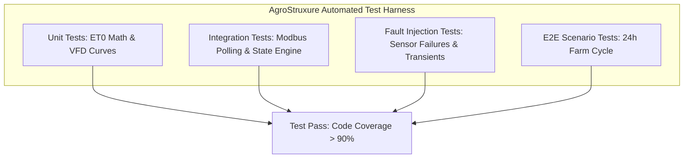

# 05 Automated Test Suites, Fault Injection & Edge Verification

**Document Code:** TEST-PLAN-05  
**Domain:** Software Quality Assurance, Fault Injection & System Test Coverage  

---

## 1. Automated Testing Architecture

The prototype test suite uses `pytest` and Jest to enforce correctness across mathematical calculations, protocol handling, and fault states:

---

## 2. Test Cases & Verification Criteria

| Test ID | Test Category | Condition / Stimulus | Expected System Response | Status |
|---|---|---|---|:---:|
| `TC-ET0-01` | Unit (Math) | Standard FAO-56 benchmark weather ($T=30^\circ\text{C}, RH=50\%, R_n=22\text{ MJ}, u_2=2\text{ m/s}$) | Calculated $ET_0 = 5.68 \pm 0.05\text{ mm/day}$ | PASS |
| `TC-VFD-02` | Unit (Physics) | VFD speed throttled from 50Hz to 40Hz | Motor power drops by $(40/50)^3 \approx 51.2\%$ | PASS |
| `TC-FLOW-03` | Integration | Soil moisture rises from 38% to 45.2% (Field Capacity) | Solenoid pulse CLOSE triggered; TeSys flips to Cold Room | PASS |
| `TC-ERR-04` | Fault Injection | Simulated borewell runs dry (Flow drops to 0 at 48Hz) | VFD trips on dry-run within 15 seconds; alarm flagged | PASS |
| `TC-ERR-05` | Fault Injection | LoRa soil sensor disconnected (packet loss > 10 min) | Controller switches to safe fallback mode; notifies farmer | PASS |
| `TC-ERR-06` | Fault Injection | Cloud network drop (cellular timeout > 60s) | Local closed-loop continues uninterrupted; queues logs | PASS |
| `TC-UX-07` | UI / Voice | Farmer triggers audio summary in Marathi | Generates natural audio audio note without hallucinated numbers | PASS |
