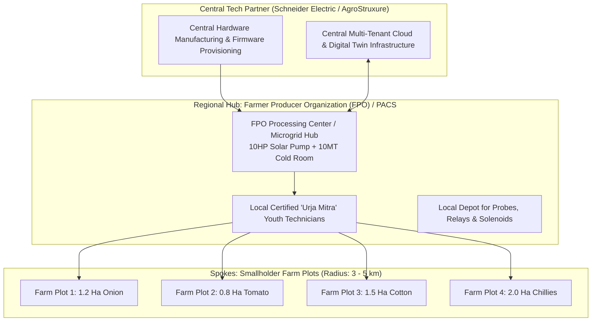

# 01 Rural Deployment Architecture & Regional Phasing

**Document Code:** DEPLOY-01  
**Domain:** Rural Logistics, Go-to-Market Execution & Regional Phasing  

---

## 1. Hub-and-Spoke Community Deployment Model

To eliminate the prohibitive sales and service costs of reaching fragmented smallholders across India's 600,000+ villages, AgroStruxure deploys through a **Hub-and-Spoke FPO Model**:



---

## 2. Three-Stage Regional Rollout Plan

```
┌────────────────────────────────────────────────────────────────────────┐
│                        3-STAGE DEPLOYMENT PHASING                      │
├─────────────────┬──────────────────────┬───────────────────────────────┤
│ Phase           │ Geography & Scale    │ Focus Milestones & Targets    │
├─────────────────┼──────────────────────┼───────────────────────────────┤
│ **Stage 1:**    │ Maharashtra          │ • 250 Pilot Farms across 5    │
│ **Proof of      │ (Nashik, Chhatrapati │   FPOs.                       │
│ Value**         │ Sambhajinagar)       │ • Validate onion/tomato cold  │
│ (Months 1–6)    │                      │   chain & 40% water savings.  │
├─────────────────┼──────────────────────┼───────────────────────────────┤
│ **Stage 2:**    │ Western & Southern   │ • 5,000 Installations across  │
│ **Regional      │ Agri Belts           │   Rajasthan, Karnataka, & MP. │
│ Expansion**     │ (Marathwada, Belgaum,│ • Formal integration with     │
│ (Months 7–18)   │ Jodhpur)             │   PM-KUSUM pump EPC vendors.  │
├─────────────────┼──────────────────────┼───────────────────────────────┤
│ **Stage 3:**    │ Pan-India Scale-Up   │ • 50,000+ Units deployed.     │
│ **National      │ (Punjab, Telangana,  │ • DISCOM Feeder-level VPP     │
│ Rollout**       │ Bihar, Odisha)       │   aggregation enabled.        │
│ (Months 19–36)  │                      │ • SE Ventures venture scaling.│
└─────────────────┴──────────────────────┴───────────────────────────────┘
```

---

## 3. Grassroots Technical Support: The "Urja Mitra" Network

A primary failure mode of rural agritech is poor post-installation maintenance. AgroStruxure establishes the **Urja Mitra ("Energy Friend") Network**:
* Recruits and trains rural ITI (Industrial Training Institute) diploma graduates and village youth.
* Provides a 3-day certified training course covering basic multimeter diagnostics, LoRa sensor pairing, and Modbus cable crimping.
* Urja Mitras earn ₹300 per installation and ₹100 per seasonal maintenance visit, creating sustainable rural employment and ensuring field uptime >98%.
