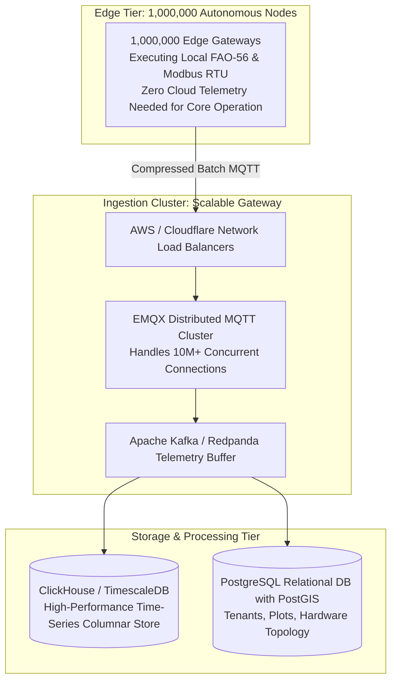

# 02 Architectural Scalability & High-Throughput Engineering

**Document Code:** SCALE-02  
**Target Scale:** 100,000 to 1,000,000 Distributed Farm Installations  

---

## 1. Architectural Scaling Philosophy: "Thick Edge, Thin Cloud"

If a cloud server had to process sensor readings every 5 seconds from 1,000,000 farms and make closed-loop pump actuation decisions, the system would collapse under network latency, bandwidth bills, and cloud compute costs.

AgroStruxure solves scalability by employing a **Decentralized Thick-Edge Architecture**:
* **100% of real-time control loops run locally** on ESP32-S3 edge microcontrollers.
* The cloud acts strictly as an asynchronous accumulator, macro digital twin, and fleet management portal.
* The network payload per farm is throttled to just **<150 Kilobytes per day** using compressed batch delta-logging.

---

## 2. Infrastructure Dimensioning: 100,000 Farm Cluster

| Dimension | Specification for 100,000 Connected Farms | Technical Strategy |
|---|---|---|
| **Concurrent Connections** | 100,000 persistent MQTT connections | 3-node EMQX cluster handling 500k connections per node. |
| **Ingress Telemetry Rate** | 1,000 messages / second (1 upload per farm every 100s) | Ingestion latency <5ms; backpressure buffered via Kafka. |
| **Daily Data Ingress** | $100,000 \times 150\text{ KB} = 15\text{ Gigabytes / day}$ | Compressed columnar storage; easily managed by ClickHouse. |
| **Monthly Cloud Cost** | ~$1,200 – $1,800 USD / month | Amortized cost: **<₹1.5 per farm per month** in cloud spend. |
