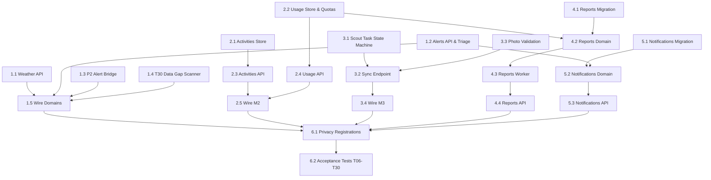

# P4 Operational Workflows — Complete Implementation Plan

**Owner:** P4 (Backend — Operational Workflows)  
**Scope:** `internal/domain/{weather,alerts,scouting,activities,reports,notifications,usage,privacy}`, `internal/adapters/weather`, `internal/adapters/postgres`, `internal/apiv1/{activities,alerts,scouting,usage,weather,reports,notifications,sync}`, `cmd/worker` (reports & alerts/sync duties).  
**Baseline Specs:** `6182.md` v1.0.0 (§03, §04, §06, §07, §09, §17), `TEAM_WORK_DIVISION.md`, `contracts/openapi.json` (`contract-v1.0.0-rc2`), `AGENTS.md`.

---

## 1. Executive Summary & Delivery Scope

P4 delivers the agronomic and operational workflows connecting satellite intelligence (P2) and farm records (P3) into actionable farmer and scout routines. 

### Implementation Progress
| Component | Schema / DB | Domain Service | Adapter / Store | API Routes | Acceptance Tests |
|---|---|---|---|---|---|
| **Weather** | 100% (00024, 00034) | 100% | 100% (Open-Meteo, Postgres) | 10% (501 Stub) | Missing (T14) |
| **Alerts** | 100% (00025, 00033) | 80% (needs P2 bridge & task conv.) | 100% (Postgres dedupe) | 10% (501 Stub) | Missing (T06, T30) |
| **Scouting** | 100% (00026, 00032) | 60% (needs task state machine) | 70% (needs query methods) | 10% (501 Stub) | Missing (T15, T16, T17) |
| **Activities** | 100% (00027) | 50% (needs transitions & cost checks) | 0% (Missing) | 10% (501 Stub) | Missing (T18) |
| **Usage / Quotas** | 100% (00022) | 50% (needs admission check) | 0% (Missing) | 10% (501 Stub) | Missing (T25) |
| **Offline Sync** | 100% (00026) | 40% (needs conflict resolution) | 40% | 0% (Unimplemented) | Missing (T15, T16) |
| **Reports** | 0% (Needs Migration) | 0% (Unstarted) | 0% (Unstarted) | 0% (Unstarted) | Missing (T20) |
| **Notifications** | 0% (Needs Migration) | 0% (Unstarted) | 0% (Unstarted) | 0% (Unstarted) | None |

---

## 2. Architecture & Invariants

All P4 implementations must strictly adhere to the repository's core architectural and security rules:

1. **Ports and Adapters (ADR 0006):**
   - Domain code in `internal/domain/<name>` declares repository and provider interfaces (**ports**).
   - Concrete implementations live in `internal/adapters/postgres` or `internal/adapters/weather`.
   - Domain packages never import adapters.
2. **Mandatory Tenant Scoping (`AGENTS.md` Rule 3 & §07.3):**
   - Every database transaction must use `WithTenant` / `WithActor` which binds `set_config('app.tenant_id', $1, true)`.
   - No unscoped `SELECT` or `GetByID` without tenant enforcement.
   - Cross-tenant queries return `404 Not Found`, never `403`.
3. **Transactional Mutations & Idempotency (§06.2):**
   - All state transitions, audit logging (`rec.Record`), and outbox events occur in the **same transaction**.
   - Mutations use `apikit.Mutate` with `If-Match: "<version>"` optimistic locking.
4. **Offline Sync Guarantees (T15, T16):**
   - Inspections submitted offline are deduplicated by `offline_operation_id`.
   - Replays must return the already persisted record without error.
   - Superseding edits require `supersedes_id` and match `base_version`.
5. **No 0 for Missing / Masked Values (`AGENTS.md` Rule 5):**
   - Absent weather parameters or unobserved crop metrics serialize as `null` / omitted, never `0`.

---

## 3. Milestone Breakdown & Technical Plan

```
P4 Roadmap:
├── Milestone 1: Weather & Alerts APIs + P2 Bridge (Tasks 4.1, 4.2, 4.3, 4.6, 4.7, 4.8)
├── Milestone 2: Activities & Usage Stores + APIs (Tasks 4.4, 4.5, 4.12)
├── Milestone 3: Scouting State Machine & Offline Sync (Tasks 4.9, 4.10, 4.11)
├── Milestone 4: Reports Engine & Worker (Task 4.13)
├── Milestone 5: Notifications & Quiet Hours (Task 4.14)
└── Milestone 6: Privacy Registration & Acceptance Verification (Tasks 4.15, 4.16)
```

---

### Milestone 1: Weather & Alerts APIs, P2 Bridge, and T30 Data Gaps

**Objectives:** Wire weather and alerts into HTTP `/v1`, hook up P2 change-detection alerts, and implement data-gap detection.

#### 1.1 Weather HTTP Transport (`internal/apiv1/weather`)
- **Fix Route Pattern:** Replace stub `/fields/{field_id}/weather` with OpenAPI contract:
  - `GET /v1/tenants/{tenant_id}/weather`: Query params `field_id`, `from`, `to`, `limit`, `cursor`.
  - `GET /v1/tenants/{tenant_id}/weather/{id}`: Fetch single sample by ID.
- **DTOs:** Map `weather.Sample` $\leftrightarrow$ `WeatherSampleDTO`. Ensure absent metrics serialize as `nil`.
- **Wiring:** Register in `internal/apiv1/domains.go` and `cmd/api/wire.go`.

#### 1.2 Alerts HTTP Transport (`internal/apiv1/alerts`)
- **Implement Endpoints:**
  - `GET /v1/tenants/{tenant_id}/alerts`: Filter by `field_id`, `status`, `severity`, `category`, pagination.
  - `GET /v1/tenants/{tenant_id}/alerts/{id}`: Single alert view.
  - `POST /v1/tenants/{tenant_id}/alerts/{id}/transition`: State transitions (`open` $\rightarrow$ `acknowledged` $\rightarrow$ `investigating` $\rightarrow$ `resolved` / `dismissed`).
    - Enforce mandatory `reason` on dismissal / rejection.
- **Convert Alert to Scout Task:** Add endpoint or action to instantiate a `scout_task` linked to `alert_id`.

#### 1.3 P2 $\rightarrow$ P4 Alert Detection Bridge
- In `internal/domain/alerts`:
  - Hook P2 change events (`internal/pipeline/detection.go`) into `alerts.Service.ProcessDetectionEvent`.
  - Validate deduplication: duplicate events in the same category do not open new episodes (enforced by migration `00033`).

#### 1.4 Data-Gap Scanner (Task 4.7 & T30)
- Add periodic duty / worker to scan fields for missing satellite observations older than threshold (e.g., 14 days without usable Sentinel-2 acquisition).
- Emits `CategoryDataGap` alert with factual summary (`"No usable satellite scene within 14 days due to persistent cloud cover"`).
- Differentiate data-gap from system failures (passes `T30`).

---

### Milestone 2: Activities & Usage Stores, Services, and APIs

**Objectives:** Implement the missing Postgres stores for activities and usage, implement atomic admission checks, and serve both via HTTP.

#### 2.1 Activities Postgres Store & Service
- **Create Store:** `internal/adapters/postgres/activities.go`:
  - `UpsertActivity(ctx, tx, a Activity) error`
  - `GetActivity(ctx, tx, id uuid.UUID) (*Activity, error)`
  - `ListActivities(ctx, tx, fieldID *uuid.UUID, status *Status, cursor ...)`
  - `UpdateActivityWithVersion(ctx, tx, a Activity, expectedVersion int) error`
- **Domain Service Expansion (`internal/domain/activities/service.go`):**
  - State machine: `planned` $\rightarrow$ `in_progress` $\rightarrow$ `completed` / `cancelled`.
  - **Invariants for `completed` (Acceptance T18):**
    - `actual_start` and `actual_end` must be provided and `actual_end >= actual_start`.
    - `actual_cost` requires both integer minor units and ISO currency code (reject mixed currencies across rollup).
    - `treated_area_ha` must be $> 0$ and $\le$ field boundary area.

#### 2.2 Usage & Entitlements Store & Service
- **Create Store:** `internal/adapters/postgres/usage.go`:
  - `GetEntitlement(ctx, tx, tenantID uuid.UUID) (*Entitlement, error)`
  - `UpsertEntitlement(ctx, tx, ent Entitlement) error`
  - `GetBucket(ctx, tx, tenantID uuid.UUID, periodStart time.Time) (*UsageBucket, error)`
  - `CreateBucket(ctx, tx, b UsageBucket) error`
  - `AppendLedgerEntry(ctx, tx, entry LedgerEntry) error`
- **Domain Service Expansion (`internal/domain/usage/service.go`):**
  - **Atomic Admission Check (Task 4.5):**
    - `AdmitJob(ctx, tx, tenantID uuid.UUID, feature string, costUnits int64) error`
    - Checks active plan limits in `app.entitlements` against current month's aggregate in `app.usage_buckets`.
    - Returns `ErrQuotaExceeded` (`402 Payment Required` or `429 Quota Exceeded`) before enqueuing costly analysis or reports.

#### 2.3 HTTP Handlers (`internal/apiv1/activities` & `internal/apiv1/usage`)
- **Activities:**
  - `GET /v1/tenants/{tenant_id}/activities`
  - `POST /v1/tenants/{tenant_id}/activities`
  - `GET /v1/tenants/{tenant_id}/activities/{id}`
  - `PATCH /v1/tenants/{tenant_id}/activities/{id}`
  - `POST /v1/tenants/{tenant_id}/activities/{id}/transition`
- **Usage:**
  - `GET /v1/tenants/{tenant_id}/entitlements`
  - `GET /v1/tenants/{tenant_id}/usage`

---

### Milestone 3: Scouting State Machine, Photo Evidence, & Offline Sync

**Objectives:** Deliver offline-capable field inspection sync, complete scout task assignment, and wire photo quarantine.

#### 3.1 Scout Task State Machine & Store Extensions
- In `internal/domain/scouting/service.go`:
  - Task status: `pending` $\rightarrow$ `assigned` $\rightarrow$ `in_progress` $\rightarrow$ `completed` / `cancelled`.
  - Permission checks: scouts can only be assigned to fields within their granted scope.
- In `internal/adapters/postgres/scouting.go`:
  - Implement `ListTasks`, `GetTask`, `UpdateTaskWithVersion`.
  - Implement `ListInspections` (filtered by `task_id`, `field_id`, or `crop_condition`).

#### 3.2 Offline Sync Engine (`internal/domain/scouting/sync.go` & `POST /v1/.../sync`)
- Endpoint: `POST /v1/tenants/{tenant_id}/sync` with payload `SyncBatch { device_id, operations []SyncOperation }`.
- **Operation Processing Loop (per operation inside transaction):**
  1. **Idempotency Check:** Verify if `operation_id` has already been applied. If yes, return existing result without error (`T15`).
  2. **Revocation Check:** Verify if the user's membership and field grants are currently active at `client_created_at`. If membership was revoked, reject with `403 Forbidden` (`T16`).
  3. **Conflict Detection:** For updates/supersedes, verify `base_version == resource.version`. If stale, return `412 Precondition Failed` / `ErrOfflineSyncConflict`.
  4. **Execution:** Insert immutable inspection or execute task status transition.
- **Response:** `SyncResponse { results []SyncResult, server_time }`.

#### 3.3 Photo Evidence Quarantine Pipeline (Task 4.11 & T17)
- Inspection photos link to `photo_asset_ids`.
- Before linking, inspection service calls `assets.Service.GetAsset(ctx, tx, assetID)` to verify:
  - Asset status is `READY` (quarantine scan passed).
  - Asset belongs to caller's tenant and matches purpose `scouting_photo`.
  - Rejects unvalidated or quarantined uploads (`T17`).

---

### Milestone 4: Reports Domain (Async Generation & Download)

**Objectives:** Implement the complete Reports subsystem from schema to worker.

#### 4.1 Schema Migration (`00041_p4_reports.sql`)
```sql
CREATE TABLE app.reports (
    id UUID PRIMARY KEY,
    tenant_id UUID NOT NULL REFERENCES app.tenants(id) ON DELETE CASCADE,
    created_at TIMESTAMPTZ NOT NULL DEFAULT NOW(),
    updated_at TIMESTAMPTZ NOT NULL DEFAULT NOW(),
    version BIGINT NOT NULL DEFAULT 1,
    name VARCHAR(255) NOT NULL,
    field_ids UUID[] NOT NULL,
    season_id UUID REFERENCES app.seasons(id) ON DELETE SET NULL,
    columns VARCHAR(64)[] NOT NULL,
    format VARCHAR(16) NOT NULL CHECK (format IN ('csv', 'pdf')),
    status VARCHAR(32) NOT NULL DEFAULT 'pending' CHECK (status IN ('pending', 'processing', 'ready', 'failed')),
    as_of TIMESTAMPTZ NOT NULL,
    asset_id UUID REFERENCES app.assets(id) ON DELETE SET NULL,
    expires_at TIMESTAMPTZ NOT NULL,
    created_by UUID NOT NULL
);

ALTER TABLE app.reports ENABLE ROW LEVEL SECURITY;
ALTER TABLE app.reports FORCE ROW LEVEL SECURITY;
CREATE POLICY reports_tenant_isolation ON app.reports
    FOR ALL
    USING (tenant_id = NULLIF(current_setting('app.tenant_id', true), '')::UUID)
    WITH CHECK (tenant_id = NULLIF(current_setting('app.tenant_id', true), '')::UUID);
```

#### 4.2 Domain Package `internal/domain/reports`
- Models: `Report`, `ReportFormat`, `ReportStatus`, `ReportRequest`.
- Store interface: `CreateReport`, `GetReport`, `ListReports`, `UpdateReportStatus`.
- Service:
  - `RequestReport(ctx, tx, req)`: checks usage entitlement, creates `pending` report, enqueues `report_generate` job.
  - `GetReport(ctx, tx, id)`: verifies caller access. Downloads go through signed URL on `asset_id`.

#### 4.3 Worker Handler (`cmd/worker/reports/handler.go`)
- Registers `Kind = "report_generate"` in `cmd/worker/handlers.go`.
- Worker routine:
  1. Fetches report definition and target field metrics (observations, weather, activities).
  2. Generates CSV or PDF document in memory.
  3. Writes bytes into object storage via `storage.Bucket`.
  4. Records asset manifest in `app.assets`.
  5. Updates report status to `ready` with `asset_id`.

#### 4.4 HTTP Transport (`internal/apiv1/reports`)
- `POST /v1/tenants/{tenant_id}/reports` $\rightarrow$ `202 Accepted` + `ReportDTO`.
- `GET /v1/tenants/{tenant_id}/reports` $\rightarrow$ `ReportListDTO`.
- `GET /v1/tenants/{tenant_id}/reports/{id}` $\rightarrow$ `ReportDTO` with download URL if ready.
- **Revocation Invariant (`T20`):** Access check re-evaluates membership on download; revoked users receive `403`.

---

### Milestone 5: Notifications & Preferences

**Objectives:** Implement user notification channels, alert dispatching, and quiet-hours filtering.

#### 5.1 Schema Migration (`00042_p4_notifications.sql`)
```sql
CREATE TABLE app.notification_preferences (
    id UUID PRIMARY KEY,
    tenant_id UUID NOT NULL REFERENCES app.tenants(id) ON DELETE CASCADE,
    created_at TIMESTAMPTZ NOT NULL DEFAULT NOW(),
    updated_at TIMESTAMPTZ NOT NULL DEFAULT NOW(),
    version BIGINT NOT NULL DEFAULT 1,
    user_id UUID NOT NULL,
    channels VARCHAR(32)[] NOT NULL, -- 'in_app', 'email', 'sms'
    min_severity VARCHAR(32) NOT NULL CHECK (min_severity IN ('low', 'medium', 'high', 'critical')),
    quiet_start VARCHAR(5), -- '22:00'
    quiet_end VARCHAR(5),   -- '07:00'
    timezone VARCHAR(64) NOT NULL,
    consent_version VARCHAR(32) NOT NULL,
    CONSTRAINT uq_user_pref UNIQUE (tenant_id, user_id)
);

CREATE TABLE app.notifications (
    id UUID PRIMARY KEY,
    tenant_id UUID NOT NULL REFERENCES app.tenants(id) ON DELETE CASCADE,
    created_at TIMESTAMPTZ NOT NULL DEFAULT NOW(),
    updated_at TIMESTAMPTZ NOT NULL DEFAULT NOW(),
    version BIGINT NOT NULL DEFAULT 1,
    user_id UUID NOT NULL,
    alert_id UUID REFERENCES app.alerts(id) ON DELETE SET NULL,
    channel VARCHAR(32) NOT NULL,
    status VARCHAR(32) NOT NULL DEFAULT 'unread' CHECK (status IN ('unread', 'read', 'archived')),
    template_code VARCHAR(64) NOT NULL,
    resource_id UUID NOT NULL,
    provider_message_id VARCHAR(128),
    read_at TIMESTAMPTZ
);

ALTER TABLE app.notification_preferences ENABLE ROW LEVEL SECURITY;
ALTER TABLE app.notification_preferences FORCE ROW LEVEL SECURITY;
ALTER TABLE app.notifications ENABLE ROW LEVEL SECURITY;
ALTER TABLE app.notifications FORCE ROW LEVEL SECURITY;
```

#### 5.2 Domain & Delivery Logic (`internal/domain/notifications`)
- **Evaluation Rules:**
  - Min severity filter: alert severity $\ge$ preference `min_severity`.
  - Quiet hours: if local time in user's timezone is between `quiet_start` and `quiet_end`, hold push/SMS until window opens; in-app notification still writes immediately.
- **HTTP Transport (`internal/apiv1/notifications`):**
  - Preferences: `GET/POST /v1/.../notification-preferences`, `PATCH .../{id}`.
  - Notifications: `GET /v1/.../notifications`, `GET .../{id}`, `POST .../{id}/read`.

---

### Milestone 6: Privacy Integration & Acceptance Verification

**Objectives:** Hook all P4 tables into the platform privacy engine and verify all acceptance scenarios.

#### 6.1 Privacy Engine Registrations (`internal/domain/privacy`)
Register P4 erasers and exporters in `privacy.Registry`:
- **Subject Erasure:** Clean up user records in `scout_tasks` (unassign), `inspections` (pseudonymize author), `activities` (unassign), `notification_preferences`, and `notifications`.
- **Tenant Erasure:** Cascade batch delete for tenant rows in `weather_samples`, `alerts`, `scout_tasks`, `inspections`, `activities`, `reports`, `notifications`, `usage_buckets`.
- **Data Export:** Export user's submitted inspections, assigned activities, and notifications.

#### 6.2 Acceptance Test Verification Suite
Implement integration tests in `internal/adapters/postgres/p4_acceptance_test.go`:
- [ ] **T06:** Alert deduplication — concurrent detection events in same category do not duplicate open episode.
- [ ] **T14:** Weather timestamps survive daylight saving time / timezone boundaries without drift.
- [ ] **T15:** Offline sync replay — identical `offline_operation_id` returns stored inspection without creating duplicates.
- [ ] **T16:** Revoked scout cannot sync inspections for fields outside current grants.
- [ ] **T17:** Inspection submission with unvalidated / quarantined photo asset is rejected.
- [ ] **T18:** Activity completion validation — verifies start/end ordering, integer minor cost units, single currency.
- [ ] **T20:** Report download authorization — rechecks membership at download time; revoked user is blocked.
- [ ] **T25:** Idempotency & usage accounting resilience under transient Redis failure.
- [ ] **T30:** Degraded satellite data-gap opens factual alert episode without flagging internal processing failure.

---

## 4. Execution Dependency Graph



---

## 5. File Change Matrix

| File Path | Action | Scope / Rationale |
|---|---|---|
| `internal/apiv1/weather/weather.go` | Rewrite | Replace 501 stub with contract `GET /weather` and `GET /weather/{id}` |
| `internal/apiv1/alerts/alerts.go` | Rewrite | Implement list, get, triage transition, and scout task conversion |
| `internal/domain/alerts/service.go` | Update | Add P2 event consumer hook and scout task link |
| `internal/adapters/postgres/activities.go` | Create | Full Postgres store for farm activities |
| `internal/domain/activities/service.go` | Update | Add transition state machine, cost checks, area validation (T18) |
| `internal/apiv1/activities/activities.go` | Rewrite | Implement activity CRUD and transition routes |
| `internal/adapters/postgres/usage.go` | Create | Postgres store for entitlements, buckets, and ledger |
| `internal/domain/usage/service.go` | Update | Atomic admission checks before heavy job enqueue |
| `internal/apiv1/usage/usage.go` | Rewrite | Implement `GET /entitlements` and `GET /usage` |
| `internal/domain/scouting/service.go` | Update | Scout task lifecycle and `base_version` conflict handling |
| `internal/adapters/postgres/scouting.go` | Update | Add task listing, updates, and inspection queries |
| `internal/apiv1/scouting/scouting.go` | Rewrite | Implement task CRUD, inspection submission, and queries |
| `internal/apiv1/sync/sync.go` | Create | Implement `POST /v1/tenants/{tenant_id}/sync` batch handler |
| `migrations/00041_p4_reports.sql` | Create | Table `app.reports` with RLS |
| `internal/domain/reports/` | Create | Models, service, CSV/PDF generator interface |
| `internal/adapters/postgres/reports.go` | Create | Postgres store for report snapshots |
| `cmd/worker/reports/handler.go` | Create | Async worker job handler for reports |
| `internal/apiv1/reports/reports.go` | Create | Implement report request, status, and download routes |
| `migrations/00042_p4_notifications.sql` | Create | Tables `app.notification_preferences` and `app.notifications` |
| `internal/domain/notifications/` | Create | Preference evaluator, quiet-hours calculator, and delivery service |
| `internal/adapters/postgres/notifications.go` | Create | Postgres store for notifications |
| `internal/apiv1/notifications/notifications.go`| Create | Implement preferences and notification inbox routes |
| `internal/domain/privacy/p4.go` | Create | Register P4 erasers and exporters |
| `internal/apiv1/domains.go` | Update | Register all P4 domain routes with `apikit.Registry` |
| `cmd/api/wire.go` | Update | Construct P4 adapters and wire into `apiv1.Domains` |
| `cmd/worker/handlers.go` | Update | Register report worker handler |
| `internal/platform/apikit/permissions.go` | Update | Move P4 permissions from `Pending` into reviewed `matrix` |
