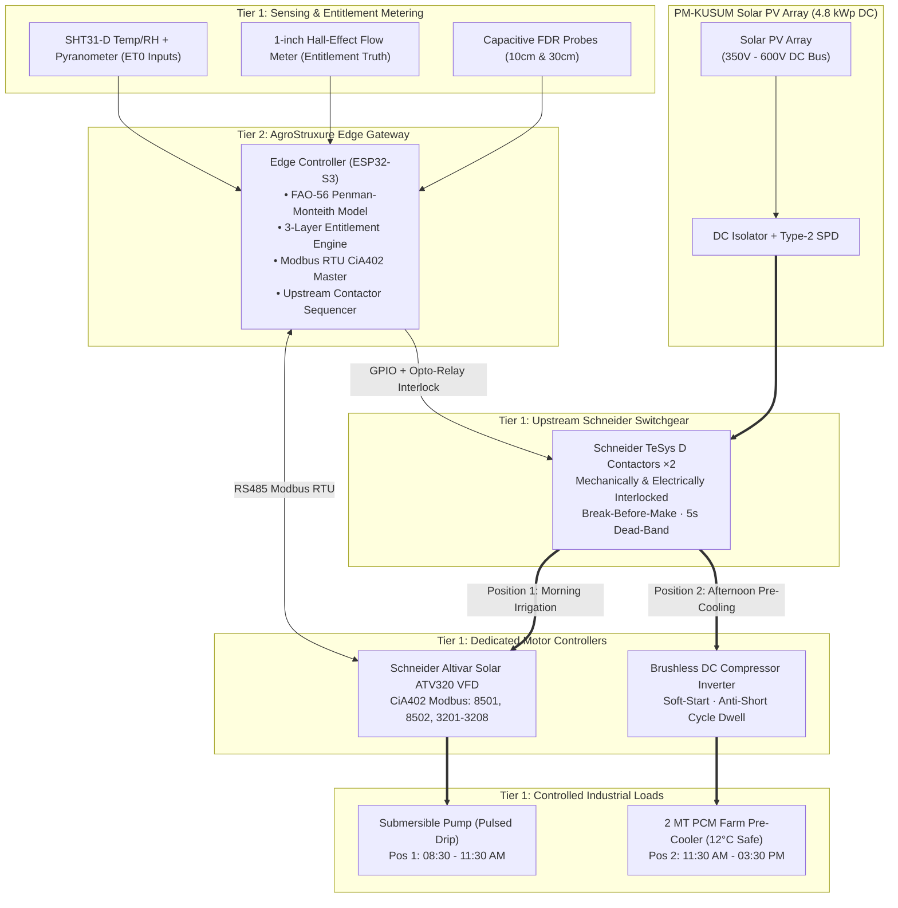

# AgroStruxure: Entitlement-Governed Solar Irrigation & Farm-Gate Pre-Cooling

> **Note:** The complete, unabridged, publication-grade proposal is maintained in [PROPOSAL.md](file:///d:/Research%20Work/YuvaYodhaHackathon%20Research/PROPOSAL.md).  
> The executable mathematical and financial model is in [impact_model.py](file:///d:/Research%20Work/YuvaYodhaHackathon%20Research/impact_model.py).

---

## Executive Summary & Vision

**AgroStruxure** is an intelligent, edge-first agricultural microgrid and precision irrigation platform engineered specifically for the socio-economic and infrastructural realities of Indian smallholder farmers under PM-KUSUM Component B. 

By natively converging **Schneider Electric’s EcoStruxure™** industrial architecture with physics-based agronomic modeling (**FAO-56 Penman-Monteith**), community-governed volumetric water budgeting (**Atal Bhujal Yojana**), and on-farm thermal pre-cooling, AgroStruxure resolves the twin crises of **groundwater rebound over-exploitation** and **farm-gate post-harvest spoilage**.

Rather than treating solar pumping and cold storage as isolated, capex-heavy silos, AgroStruxure unites them through **safe, upstream DC bus time-sharing**. When the daily scientific water entitlement is satisfied, the edge controller decelerates the pump to 0 Hz, verifies zero flow, and engages **Schneider TeSys D** DC switchgear upstream of all drives. Midday solar surplus (3.4 kW average) is safely diverted to an on-farm **2 MT Phase-Change Material (PCM) pre-cooler**, cooling perishables to a crop-safe 12 °C setpoint at zero marginal electricity cost.

```
┌────────────────────────────────────────────────────────────────────────────────────────┐
│                                 THE PARADIGM SHIFT                                     │
├────────────────────────────────────────┬───────────────────────────────────────────────┤
│ Traditional Solar Pumping (PM-KUSUM)   │ AgroStruxure Autonomous Microgrid             │
├────────────────────────────────────────┼───────────────────────────────────────────────┤
│ • Zero marginal electricity cost leads │ • Seasonal volumetric entitlement and closed- │
│   to 16%–39% rebound over-pumping.     │   loop drip save 41% groundwater (7,000 m3/yr)│
│ • Afternoon solar peak (11:30–15:30)   │ • 77% surplus utilization via dynamic DC load │
│   sits 63% idle / wasted (4,137 kWh/yr)│   diversion to 2 MT farm-gate pre-cooler.     │
│ • Perishables suffer 8.37% farm-stage  │ • On-farm 12°C pre-cooling preserves 1.31 t/yr│
│   heat spoilage before reaching mandi. │   produce; avoids damaging 4°C chilling injury│
│ • Passive observational dashboards or  │ • Closed-loop edge control with Schneider     │
│   unconnected cold room with own array.│   Altivar ATV320 VFD and TeSys D switchgear.  │
└────────────────────────────────────────┴───────────────────────────────────────────────┘
```

---

## 1. System Architecture Diagram



---

## 2. The Diurnal Operational Cycles

1. **08:30 AM – 11:30 AM (Precision Irrigation & Entitlement Burndown):**
   * Reads soil moisture from dual-depth capacitive FDR probes (10cm & 30cm) and ambient data from SHT31-D and pyranometer.
   * Gateway writes to Modbus `8501` (`CMD`) to run the **Schneider Altivar Solar ATV320 VFD**, soft-ramping above the 36 Hz static-head cut-in floor.
   * Pulsed drip irrigation delivers water directly to crop root zones; Hall-effect flow meter decrements seasonal entitlement.
2. **11:30 AM (Deceleration, Anti-Water Hammer & Dead-Band Transition):**
   * Daily volume $V_{day}$ reached. Gateway commands 8-second deceleration to 0 Hz on register `8501`.
   * Gateway reads register `3202` (`RFRd` = 0 Hz), register `3201` (`ETA` = stopped), and flow meter ($Q = 0\text{ LPM}$).
   * 12 V latching valve pulses shut under zero flow velocity, eliminating water hammer.
   * Mandatory **5-second dead-band dwell** allows DC bus discharge.
3. **11:30 AM – 03:30 PM (Solar Surplus Cold-Chain Diversion):**
   * Gateway energizes TeSys Contactor 2 on the DC bus.
   * Peak afternoon solar surplus (3.43 kW average) is routed to the on-farm **2 MT Phase-Change Material (PCM) Pre-Cooler**.
   * Pulls freshly harvested tomato batch down from 32 °C to a safe **12 °C setpoint**, preventing chilling injury and eliminating the 8.37% farm-stage heat loss.

---

## 3. Key Quantified Outcomes (Single Source of Truth)

All metrics derived from [impact_model.py](file:///d:/Research%20Work/YuvaYodhaHackathon%20Research/impact_model.py):
* **41.2% Groundwater Conserved:** 7,000 m³/ha/year saved, locked against rebound expansion by Layer 3 entitlement.
* **1,696 kWh/year Pumping Electricity Freed** per hectare.
* **4,137 kWh/year Surplus Put to Work:** 63% of solar PV generation sits idle today; AgroStruxure captures 3,187 kWh/year (77% of surplus).
* **1.31 Tonnes/ha/year Perishable Produce Preserved:** Worth ₹15,732/year in direct savings + ₹12,000/year distress-sale avoidance.
* **₹91,000 Shared-Array PV Capex Avoided** per cluster.
* **2.0-Year Payback (Tier A Pre-Cooler)** across a 4-farm cluster (3.0 years unsubsidized).
* **Complete Controller BOM:** **₹7,540** at 1,000-unit scale.
