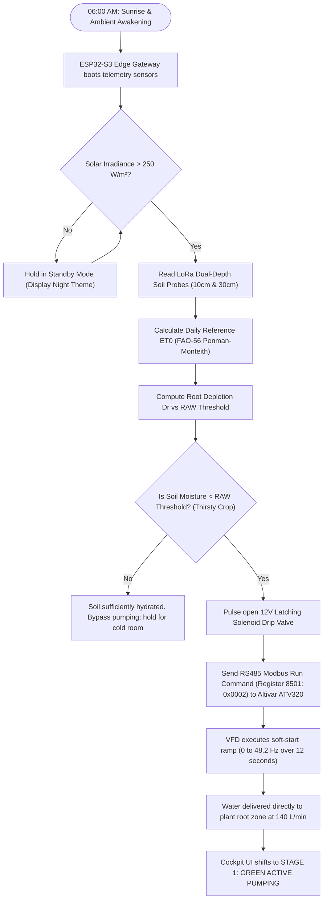
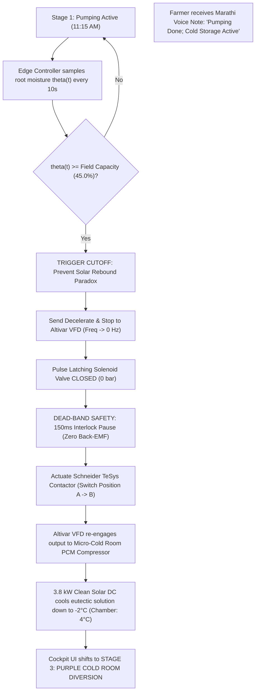
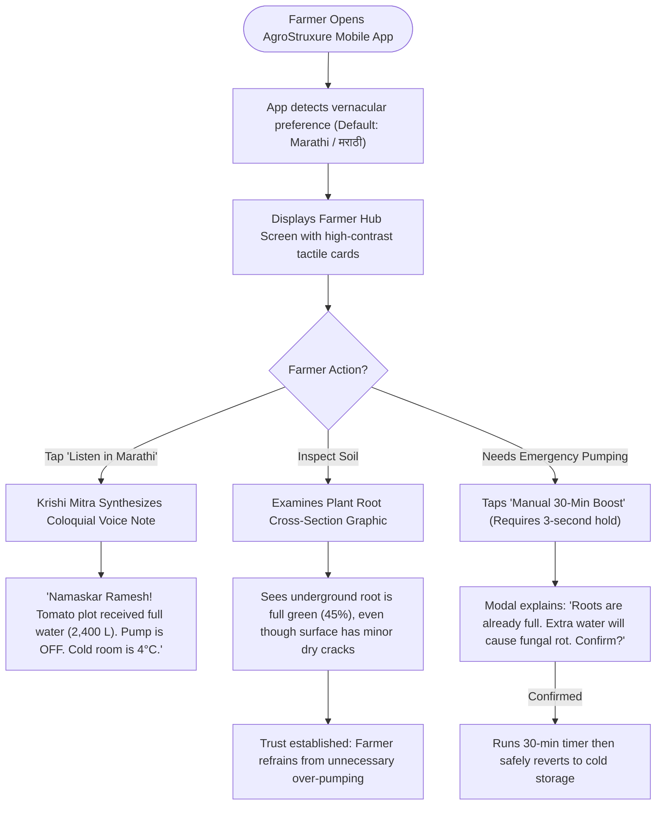
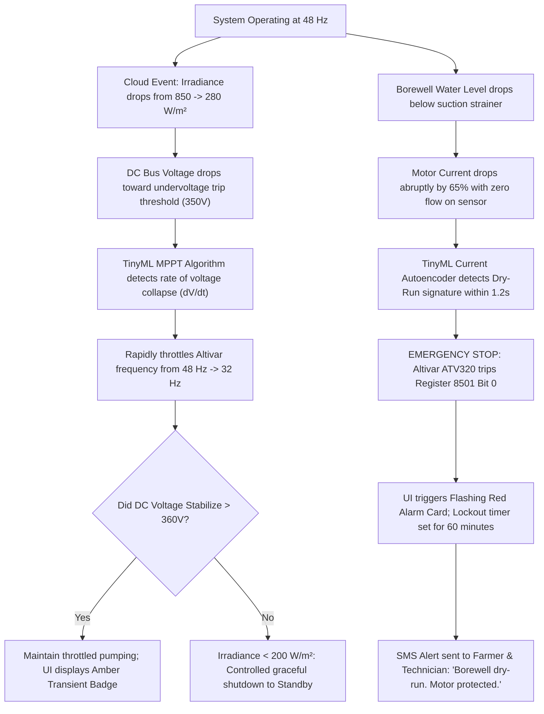
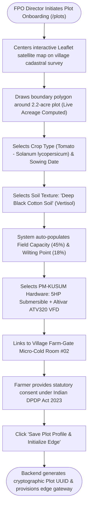
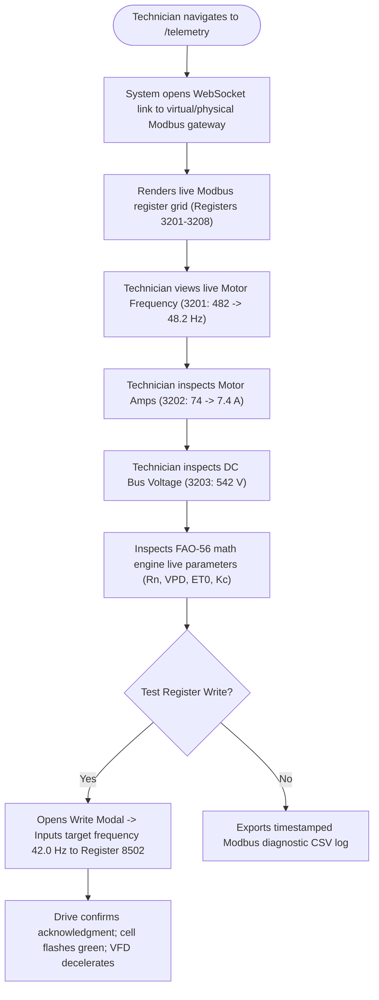
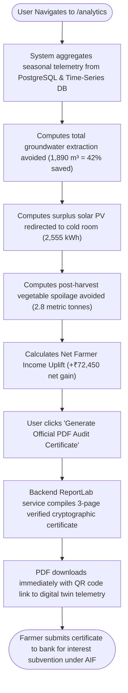

# AgroStruxure™ Complete User Flows & System State Transitions

> **Superseded figures (2026-10-03).** This document predates the corrected impact model. Numbers such as 42–64% water saving, 2,555 kWh, 4,200 kWh, 2.8 t, +₹72,450, "<18-day payback", ₹3,480 BoM, 3,187 kWh "captured" and 2.94 t CO₂e are retired. Quote figures only from `docs/08_CLAIM_LEDGER.md` (41.2%, 7,000 m³, 1,062 kWh cluster cooling, 1.31 t, ₹25,332/yr, 2.0-year payback, ₹7,540 BoM, 0.39 t CO₂e).

**Document Code:** FLOW-UX-01  
**Project:** AgroStruxure™ (Yuva Yodha 2026 / Schneider Electric India)  
**Author:** Senior UX Architect & System Engineer  
**Status:** Complete State-Machine & Journey Contract  

---

## Table of End-to-End User Flows
1. [Flow 1: Morning Precision Irrigation Sequence](#flow-1-morning-precision-irrigation-sequence)
2. [Flow 2: Midday Field Capacity Cutoff & Cold Storage Diversion](#flow-2-midday-field-capacity-cutoff--cold-storage-diversion)
3. [Flow 3: Smallholder Vernacular Advisory & Voice Copilot Experience](#flow-3-smallholder-vernacular-advisory--voice-copilot-experience)
4. [Flow 4: Edge Fault Detection, Cloud Transient & Safety Recovery](#flow-4-edge-fault-detection-cloud-transient--safety-recovery)
5. [Flow 5: Plot Delineation, Soil Profile & DPDP Consent Onboarding](#flow-5-plot-delineation-soil-profile--dpdp-consent-onboarding)
6. [Flow 6: Industrial Modbus RTU Commissioning & Drive Inspection](#flow-6-industrial-modbus-rtu-commissioning--drive-inspection)
7. [Flow 7: End-of-Season Impact Audit & Verified PDF Certificate Export](#flow-7-end-of-season-impact-audit--verified-pdf-certificate-export)

---

## Flow 1: Morning Precision Irrigation Sequence

### Scenario Summary
Smallholder farmer Ramesh Patil has a 2.2-acre tomato crop in Marathwada. At dawn, solar power rises. Rather than manually walking to the pump shed at night or letting the pump run unchecked, AgroStruxure initiates precision irrigation based on real-time soil and meteorological physics.

### UI & System States During Flow 1
- **UI State:** Top banner illuminates in Schneider Electric green (`#3DCD58`); water flow animation active; Altivar dial sweeps to 48.2 Hz; soil moisture gauge shows water level rising.
- **Physical Safety:** Soft-start ramp prevents water hammer in PVC drip lines and protects motor windings from inrush spikes.
- **Farmer Feedback:** Notification on WhatsApp/SMS: *"Namaskar Ramesh. Solar pumping started for your tomato plot."*

---

## Flow 2: Midday Field Capacity Cutoff & Cold Storage Diversion

### Scenario Summary
At 11:30 AM, solar irradiance reaches its peak (850 W/m²). The root zone reaches Field Capacity ($FC = 45\%$). Traditional PM-KUSUM setups continue over-pumping, wasting water and drowning roots. AgroStruxure cuts water extraction and shifts 100% of peak power to on-farm cold storage.

### Edge Transitions & Physical Interlocks
- **Contactor Interlock:** An electrical and software dead-band of **150ms** is enforced to ensure the pump motor has completely demagnetized before the compressor circuit is closed, eliminating phase arcing.
- **Energy Accounting:** Diverted kilowatt-hours are logged into the cumulative cold-storage energy counter (Register `3208`).

---

## Flow 3: Smallholder Vernacular Advisory & Voice Copilot Experience

### Scenario Summary
Farmer Ramesh opens the mobile app or receives a WhatsApp voice audio note. He wants to know if he needs to pump more water and verify his cold storage temperature.

---

## Flow 4: Edge Fault Detection, Cloud Transient & Safety Recovery

### Scenario Summary
During the monsoon season, a heavy rain cloud obscures the solar PV array. Solar irradiance drops from 850 W/m² to 280 W/m² in 4 seconds. Simultaneously, a borewell suction pipe develops an air pocket, risking motor cavitation.

---

## Flow 5: Plot Delineation, Soil Profile & DPDP Consent Onboarding

### Scenario Summary
FPO Director Sunita Shinde registers a new marginal farmer's plot in the district database.

---

## Flow 6: Industrial Modbus RTU Commissioning & Drive Inspection

### Scenario Summary
Schneider Electric field technician Suresh Kumar or a hackathon jury judge inspects the live communications between the edge gateway and the Altivar ATV320 drive.

---

## Flow 7: End-of-Season Impact Audit & Verified PDF Certificate Export

### Scenario Summary
At harvest, farmer Ramesh and FPO Director Sunita generate the verified **AgroStruxure™ Farm Energy & Water Audit Certificate** to qualify for PMKSY subsidies and claim carbon credits.

