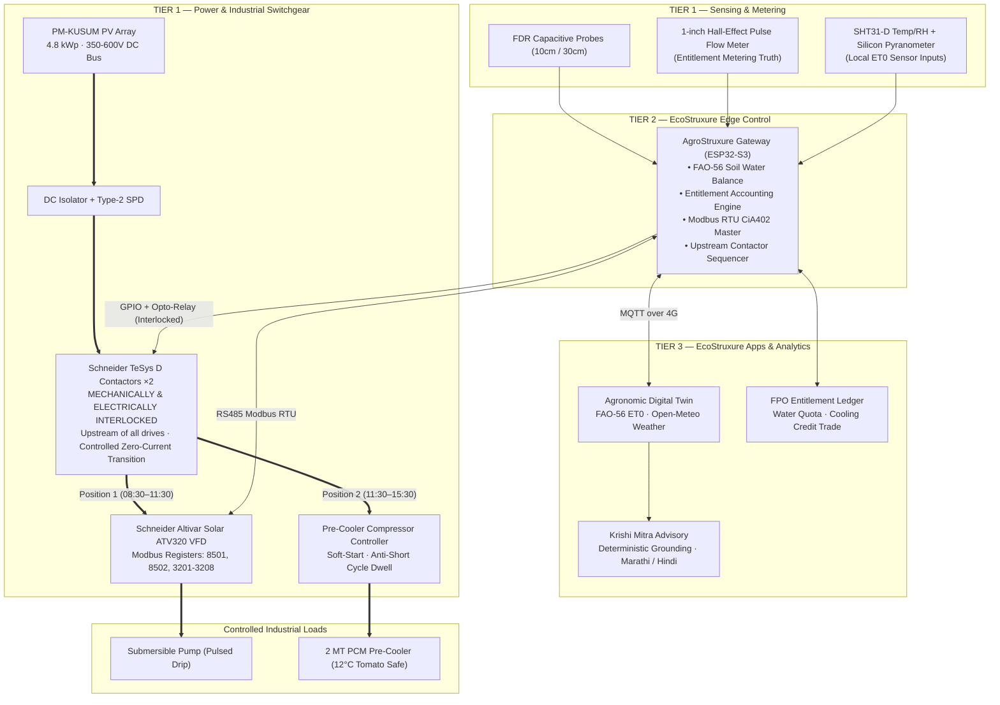

# AgroStruxure: An Agricultural Energy Orchestration Platform for Schneider Solar Infrastructure

**Document Code:** YUVA-YODHA-2026-PROP-02 (supersedes PROP-01)  
**Track:** Challenge 01 — Sustainable Agriculture: Energy, Water & Productivity  
**Host:** Schneider Electric India  
**Date:** October 2026  
**Status:** Comprehensive Technical Proposal & Implementation Blueprint  
**Subtitle:** Entitlement-Governed Solar Irrigation & Farm-Gate Pre-Cooling  
**Core invention:** Dynamically reallocating surplus solar generation from irrigation to farm-gate thermal storage.  

> **On this revision (PROP-02).** PROP-01 contained four defects that would not survive technical review: a power topology that switched contactors on a VFD output, a 4 °C setpoint that damages chilling-sensitive produce, an ET₀ engine with no sensors to feed it, and impact figures that contradicted each other across documents. All four are corrected here. Every number in Section 9 is produced by `impact_model.py` in this repository — run `python impact_model.py` and the figures reproduce identically. Where a claim is uncertain, it is labelled rather than rounded up.

---

## Strategic Proposal to Schneider Electric India

**The proposal.** We propose AgroStruxure™ to Schneider Electric India as an **OEM skid and software package** that extends EcoStruxure into off-grid agriculture. It turns a single-function solar pump drive into a multi-load microgrid hub: the PV array that runs the pump also runs a shared farm-gate pre-cooler, under a water entitlement that stops solar rebound.

| EcoStruxure tier | AgroStruxure element | Schneider portfolio touchpoint |
|---|---|---|
| **Connected Products** | FDR probes, flow meter, SHT31 + pyranometer; solar pump drive; interlocked contactor pair | Altivar ATV320 (Modbus RTU, Reg 8501 command / 8502 speed reference); TeSys D LC1D09BD × 2 |
| **Edge Control** | ESP32-S3 controller: FAO-56 budget, field-capacity cutoff, controlled zero-current changeover; runs offline | EcoStruxure edge pattern; drive-agnostic fallback through Run/Stop digital I/O |
| **Cloud Apps & Analytics** | FastAPI telemetry, read-only vernacular advisory, FPO fleet dashboard | EcoStruxure Apps pattern; SE Ventures path to scale |

**Commercial synergy.**
* **New tenders:** Altivar ATV320 + TeSys D changeover + AgroStruxure gateway pre-wired as a factory skid (§5.4). This converts Schneider's single-function solar drive into a multi-load microgrid hub.
* **Installed base:** 4,137 kWh/yr modelled surplus (63.1%) in our 4.8 kWp reference system; Component B installed base (816,710 pumps as of Aug 2026, MNRE; team-supplied, confirm on the dashboard) provides the target deployment opportunity. The retrofit mode is drive-agnostic. Schneider's own share of that fleet is not documented here.
* **Recurring revenue:** fleet SaaS and cooling-as-a-service (§13).
* **Partnership status:** Schneider Electric's rural EPC channel and Sahyadri Farmers Producer Co. are **proposed partners only**. No agreement exists.

### Dual-Plane Architecture and Load Portfolio

* **Control plane:** Sensors (soil, flow, PV, temperature) → ESP32-S3 edge controller → Modbus RTU commands (CiA402 profile) to the Altivar ATV320 VFD.
* **Power plane:** PV array (4.8 kWp) → power conversion / interlocked switch stage → Load A (solar pump) / Load B (PCM chiller).
* Irrigation is scheduled according to crop water requirement and soil moisture telemetry, while PV generation continues through midday.

| Load portfolio | Loads |
|---|---|
| **CURRENT PROTOTYPE** | Solar pumping + soil/water control + PCM cooling |
| **EXPANSION ROADMAP** | Crop drying + packhouse sorting + dairy chilling + water treatment |

The current-prototype scope is simulated in Phase 1 and built on the HIL bench in Phase 2 (see §10). Roadmap loads are not modelled, and no energy, revenue or percentage split is claimed for them. **PCM specification:** encapsulated salt hydrate PCM, target 12–15 °C melt point and 190–210 kJ/kg latent heat (design target, assumption A18; confirm the vendor datasheet).

### Solar Surplus Physics: The Cooler Does Not Depend on Irrigation Savings

| Quantity (4.8 kWp array, Nashik, 1 ha tomato) | kWh/yr | Share of PV | Basis |
|---|:---:|:---:|---|
| PV generation | **6,559** | 100% | 4.8 kWp × 4.8 h × 365 × 0.78 |
| Flood pumping (today) | 4,118 | 63% | 17,000 m³ × 0.242 kWh/m³ |
| **Idle PV today** | **2,442** | **37%** | already idle, before any water saving |
| Pumping once water is right-sized | 2,422 | 37% | 10,000 m³ × 0.242 kWh/m³ |
| **Modelled surplus once irrigation is right-sized** | **4,137** | **63.1%** | idle today + 1,696 kWh freed |
| **4-farm cluster pre-cooler** | **1,062** | 16% | 60 batches × 17.7 kWh |
| **Unallocated headroom** | **3,075** | **46.9%** | 4,137 − 1,062; future loads or grid feed-in |

* **Three-step balance:** 6,559 kWh PV → 2,422 kWh pumping → 1,062 kWh pre-cooling → 3,075 kWh (46.9%) unallocated headroom.
* The pre-cooler draws 1,062 kWh, which is **43% of the 2,442 kWh that is already idle today**. It needs no irrigation saving to run.
* Once water is right-sized the surplus grows to 4,137 kWh, a **≈4× energy margin** for cooling (3.9×).
* **Limit of this argument:** it is an annual energy balance. The cooler needs 3.43 kW for about 4 h at midday on harvest days. Coincident power depends on harvest-day scheduling (the controller lets the pump yield to the cooler); the simulator and the Phase 2 hardware bench must confirm the overlap.
* Water credits therefore do not buy cooling *energy*. They ration pre-cooler time slots and reward entitlement compliance (§6.2).

### Why a Phase-Change Store and Not a Battery

1. **Capital cost and ROI.** One batch-day needs 17.7 kWh of electricity (13.7 pull-down + 4.0 hold). Carrying all of it through a battery means ≈22 kWh nominal at 80% depth of discharge; carrying only the overnight hold means ≈5 kWh. At an indicative ₹10,000–20,000 per installed kWh (assumption A16, get quotes) that is ₹2.2–4.4 lakh for the full batch-day (₹55,000–110,000 per farm across four farms) or ₹0.5–1.0 lakh for the hold alone, before inverter and charge electronics and replacement. The PCM plates are part of the ₹400,000 cooler (compressor + PCM) that four farms share, and the whole cold-chain share after subsidy is ₹50,212 per farm.
2. **Economic value per kWh.** On physical loss reduction alone (the base case), cooling turns surplus solar into **≈₹59 per kWh** gross ((₹15,732 × 4 farms) ÷ 1,062 kWh) or ₹50/kWh net of ₹2,400 opex per farm. With the optional price-timing scenario it is ≈₹104/kWh gross, ₹95 net. Putting the same kWh into a battery for general use, or exporting it, is worth about ₹3–5/kWh (assumption A17, indicative tariff).
3. **Rural thermal durability.** A PCM store has no electrochemical cycling and sits at the room's own temperature. Specification (assumption A18): encapsulated salt hydrate PCM, target 12–15 °C melt point (the low end, ≈12 °C, so the store holds the room near the 12 °C setpoint) and 190–210 kJ/kg latent heat. About 216 kg (206–227 kg) carries the 4.0 kWh overnight hold (12 kWh thermal ÷ 0.2 MJ/kg). Design life target 10 years in 45 °C ambient (assumption A15: confirm the vendor's rated freeze–thaw cycles and supercooling or phase-separation behaviour before quoting). Lithium and lead-acid batteries age faster under sustained heat and daily deep cycling. Small LiFePO₄ cells stay in the field sensor nodes; this argument is about bulk storage.

### Modularity: Buy the Kit Alone, or Add the Cluster Cooler

| | **Standalone retrofit kit** | **Cluster pre-cooler add-on** |
|---|---|---|
| **Cost** | ₹7,540 BoM at 1,000 units | ₹50,212 per farm after 35% MIDH/AIF (₹400,000 gross for one shared 2 MT unit, 4 farms) |
| **Works on** | Any PM-KUSUM pump (drive-agnostic) | Horticulture clusters. Tomato is modelled; chili and leafy greens need their own setpoints (not modelled). Wheat and cotton do not need it |
| **Benefit** | Enforces the water entitlement on a drip-irrigated plot: 2,000 m³/ha/yr of the 7,000 m³/ha/yr reduction in modelled irrigation water application is attributable to the kit (5,000 m³ comes from drip hardware, assumed installed). Pump and yield protection ≈ ₹5,000/yr (assumption) | **Base case:** 1.31 t preserved = ₹15,732/yr, net ₹13,332 per farm. **Optional price-timing scenario:** +₹12,000, net ₹25,332 |
| **Payback** | 1.5 years (3 crop seasons) | **Base case 3.8 years** (≈7.5 harvests; 5.8 unsubsidised). With the optional timing scenario 2.0 years (3.0 unsubsidised) |

Reduced irrigation demand has no farm-gate cash value while solar power is free, so it is **not** counted in either payback. It is a modelled reduction in irrigation water application, not a measured aquifer-protection claim. The financial return rests strictly on physical produce-loss reduction; price-timing arbitrage is an optional scenario only.

### Status and Claims We Do Not Make
* **Development status:** **Phase 1 completed:** code (`impact_model.py`), math model and AgroSim (team-reported; AgroSim source is not in this repository, so link it before submission). **Phase 2 prototype:** hardware-in-the-loop (HIL) test bench with Altivar ATV320 and TeSys D. No field data exists. See §10.
* **Partnerships:** proposed only (see above).
* **Carbon:** the headline is **0.39 t CO₂e/ha/yr**, the embodied emissions of 1.31 t/ha/yr of preserved produce. Diesel displacement (+0.21 t CO₂e) is **not claimed**, because smallholders have no cooling today.

---

## Table of Contents

0. [Strategic Proposal to Schneider Electric India](#strategic-proposal-to-schneider-electric-india)
1. [Thesis](#1-thesis)
2. [Problem: What the Evidence Actually Says](#2-problem-what-the-evidence-actually-says)
3. [Why Existing Solutions Do Not Close the Loop](#3-why-existing-solutions-do-not-close-the-loop)
4. [Solution Architecture](#4-solution-architecture)
5. [Power Topology and Electrical Design](#5-power-topology-and-electrical-design)
6. [The Water Entitlement — The Economic Lock](#6-the-water-entitlement--the-economic-lock)
7. [Thermal Design and Crop-Specific Setpoints](#7-thermal-design-and-crop-specific-setpoints)
8. [Mathematical & Hydraulic Foundation](#8-mathematical--hydraulic-foundation)
9. [Quantified Impact — Every Figure Derived](#9-quantified-impact--every-figure-derived)
10. [ENGINEERING ARTIFACTS](#10-engineering-artifacts)
11. [Technology Stack & Architectural Rationale](#11-technology-stack--architectural-rationale)
12. [Prototype Scope & 5-Minute Demo Arc](#12-prototype-scope--5-minute-demo-arc)
13. [Deployment, Policy Alignment & Scalability](#13-deployment-policy-alignment--scalability)
14. [Risks and Falsification Criteria](#14-risks-and-falsification-criteria)
15. [Assumption Register](#15-assumption-register)
16. [Appendix A — Changes from PROP-01](#appendix-a--changes-from-prop-01)
17. [Appendix B — Official Sources & References](#appendix-b--official-sources--references)

---

## 1. Thesis

> **Corrected 2026-10-03.** Cold-chain energy now follows tonnes actually cooled (60 batches/yr for a 4-farm cluster = 1,062 kWh/yr, 26% of the host farm's idle surplus), not 180 operating days (3,187 kWh). The 63% idle PV is the surplus *after* irrigation is right-sized (37% is idle today under flood). Headline carbon is 0.39 t CO₂e/ha/yr (embodied emissions of avoided spoilage); the diesel-genset credit (+0.21 t) is a scenario only. See `docs/08_CLAIM_LEDGER.md` and `research/08_IMPACT/impact_model.py`.

> *Long-form proposal. For the portal's 300–500-word summary use `EXEC_SUMMARY_500W.md`.*

India's solar irrigation programme has solved an energy problem and created a water problem. Under PM-KUSUM, the Component B installed base (**816,710 standalone solar pumps as of Aug 2026**, MNRE; team-supplied, confirm on the dashboard) provides the target deployment opportunity. Each one hands a farmer electricity at **zero marginal cost** — and with it, no economic reason ever to stop pumping.

The literature is clear that this is not an information failure. Farmers are not over-irrigating because they lack a soil moisture reading. They are over-irrigating because *stopping has no economic value*. A controller that says "stop" solves nothing if stopping costs the farmer potential yield and gains him nothing.

**AgroStruxure makes stopping pay.**

The edge controller enforces a seasonal **water entitlement** rather than an observational moisture threshold, and rewards every unspent cubic metre with **cold-chain capacity** (pre-cooler time slots; the cooling energy itself exists with or without the savings) — the one thing a horticulture smallholder cannot buy cheaply and values immediately. Water the farmer does not pump becomes storage he can use or trade.

This is the off-grid implementation of a mechanism already proven in the field. IWMI's Dhundi cooperative in Gujarat gave farmers a paid destination for surplus solar energy — a grid buyback plus an explicit groundwater conservation bonus — and measured extraction fell. Dhundi needed a DISCOM, a 25-year PPA, and a cooperative grid tie. **Component B farms have none of those.** AgroStruxure delivers the same incentive structure in hardware, at the pump shed, where the grid cannot reach.

> **One-line positioning.** AgroStruxure is SPaRC for off-grid farms: it monetises *not pumping* by routing freed solar energy into farm-gate pre-cooling, governed under a community water entitlement.

---

## 2. Problem: What the Evidence Actually Says

### 2.1 The Rebound Effect is Documented, Not Hypothetical
Subsidised electricity has long driven groundwater over-abstraction, and solar irrigation risks worsening it precisely because marginal cost approaches zero. Field econometric measurement in Rajasthan (Gupta, 2019, *Energy Policy*) found solar pump adoption **increased** average groundwater consumption in groundwater-dependent districts (Jaipur, Sikar) by **16% to 39%**.

The corrective finding matters more than the problem statement: groundwater outcomes are driven more by **cropping patterns and irrigation demand** than by the energy source, and **demand-side governance** is what prevents rebound. Technology that improves efficiency without governing demand invites Jevons expansion — water saved per hectare is spent on irrigating additional hectares. 

**Design consequence:** Efficiency alone is insufficient. The system must cap volume, not just optimize single irrigation events.

### 2.2 Idle Solar Capacity: Today and Once Water Is Right-Sized
Our model quantifies the second effect. A 4.8 kWp array on a 1 ha tomato farm generates 6,559 kWh/year. Flood pumping uses 4,118 kWh, so 2,442 kWh (37%) is idle today. Once irrigation is right-sized, pumping falls to 2,422 kWh and **4,137 kWh/year (63% of generation) has no pumping use**. That surplus is the physical resource AgroStruxure puts to work, and the 2,442 kWh already idle today is enough on its own to run the cluster pre-cooler (1,062 kWh).

### 2.3 Post-Harvest Loss — The Correct Baseline
PROP-01 cited "15–20% spoilage" and "₹92,000 Cr". Both are stale and easily challenged:
* **NABCONS 2022 (MoFPI):** National post-harvest loss is **₹1.53 lakh crore** (~2.35% of national GDP), superseding the ICAR-CIPHET 2015 figure (₹92,651 Cr).
* **Tomato Loss:** 11.62% total, with **8.37% occurring at the farm-gate/harvesting stage** due to rapid field heat accumulation and ambient degradation.
* The **8.37% farm-stage share** is the exact portion on-farm pre-cooling eliminates. Claiming 8.37% rather than 20% is verifiable, defensible, and ours to make.

### 2.4 Target Market
* **Component B (Off-grid Standalone):** installed base of 816,710 pumps as of Aug 2026 (MNRE; team-supplied, confirm on the dashboard) is the target deployment opportunity; earlier drafts quoted ≈10.06 lakh (31 Jan 2026, secondary source), and the two must be reconciled. In our 4.8 kWp reference system the modelled surplus is 4,137 kWh/yr (63.1%). **This is AgroStruxure's primary market.**
* **Component C (Feeder-Solarised / Individual Solarised):** Entitlement governance applies directly to prevent aquifer rebound even where surplus feeds the grid.

---

## 3. Why Existing Solutions Do Not Close the Loop

| Solution / Player | Current Mechanism | The Gap AgroStruxure Fills |
|---|---|---|
| **Ecozen** (Ecotron + Ecofrost) | Solar pump drive + solar cold room (>50% market share) | Sold as **two separate products requiring two separate PV arrays**. Zero energy routing between them; zero volumetric water governance. |
| **Fasal, Cultyvate** | Microclimate & soil moisture IoT advisory | Advisory only — zero actuation, zero load routing, no volumetric cap. |
| **Kisan Raja & GSM Starters** | Remote pump on/off via mobile phone | Makes pumping *easier*, accelerating rebound extraction. |
| **IWMI Dhundi / SPaRC** | Grid buyback + water conservation bonus | Requires DISCOM PPA + high-voltage grid line. Unavailable to off-grid Component B. |

### The Defensible Core Claim
An Ecofrost cold room ships with its own dedicated 4 kWp PV array. Meanwhile, the farm's solar pump array sits idle 63% of the year 200 metres away. Nobody has coupled them safely.
> **AgroStruxure's core novelty is the shared-array energy router governed by a volumetric water entitlement.** It eliminates the pre-cooler's dedicated PV array — **₹91,000 of avoided capex** and associated land — by time-sharing an existing, taxpayer-subsidised PM-KUSUM PV asset.

---

## 4. Solution Architecture

### 4.1 Two Tiers of Cooling — Sizing Reality
Cooling a 5 MT cold room down from 32°C field heat requires 8.56 kW continuous power — exceeding a 4.8 kWp pump array (`impact_model.py` §2b). Sizing physics forces a logical two-tier split:
* **Tier A — Farm Pre-Cooler (4-Farm Cluster):** 2 MT batch capacity, **shares the pump's 4.8 kWp array** (requires 3.43 kW average, fits comfortably). Sited at the pump shed. Eliminates the critical **8.37% farm-stage heat loss**. Avoids ₹91,000 PV capex.
* **Tier B — FPO Aggregation Holding Room (20-Farm Hub):** 5 MT capacity, equipped with its own dedicated 4 kWp array. Sited at the village collection hub for multi-day storage to capture market price timing. Claims **no** shared-array saving.

### 4.2 End-to-End System Diagram



---

## 5. Power Topology and Electrical Design

### 5.1 The Blocker in PROP-01 & The Engineering Fix
PROP-01 placed the changeover contactor downstream of the VFD AC output (`PV → VFD → TeSys → Pump | Cold Room`). This is a critical electrical error:
1. **PWM Output Switching Prohibited:** Switching an electromechanical contactor under live VFD output creates destructive $dV/dt$ voltage spikes and arc flash that destroy drive output IGBTs. Drive manufacturers explicitly prohibit downstream contactor switching without prior deceleration to 0 Hz and complete inverter bridge disablement.
2. **Motor Tuning Mismatch:** A VFD output produces variable-frequency PWM AC tuned strictly to the pump motor's inductive parameters and $V/f$ curve. A refrigeration compressor cannot run on a pump drive's output.
3. **Dedicated Compressor Protection Required:** Refrigeration compressors demand soft-start, crankcase heating, low/high-pressure safety trips, and a minimum 5-minute anti-short cycle dwell.

### 5.2 Corrected Upstream DC Bus Topology
The changeover is relocated **upstream of all motor drives onto the 350–600 V DC bus**:

```
                  PM-KUSUM PV ARRAY (4.8 kWp, 350–600 V DC)
                                     │
                           ┌─────────┴─────────┐
                           │ DC Isolator + SPD │
                           └─────────┬─────────┘
                                     │
           ╔═════════════════════════╧═════════════════════════╗
           ║     CHANGEOVER — Schneider TeSys D ×2             ║
           ║     Mechanically & Electrically Interlocked       ║
           ║     Break-Before-Make · Zero-Current Transition   ║
           ║     Driven by ESP32-S3 via Opto-Isolated Relays   ║
           ╚══════════════╦═════════════════════════╦══════════╝
            POSITION 1    ║             POSITION 2  ║
                          ▼                         ▼
            ┌────────────────────────┐  ┌────────────────────────┐
            │ Altivar Solar ATV320   │  │ Dedicated Compressor   │
            │ VFD · MPPT · Modbus    │  │ Inverter Controller    │
            └───────────┬────────────┘  └───────────┬────────────┘
                        ▼                           ▼
            ┌────────────────────────┐  ┌────────────────────────┐
            │ 5 HP Submersible Pump  │  │ 2 MT PCM Pre-Cooler    │
            └────────────────────────┘  └────────────────────────┘
```

### 5.3 Automated Actuation & Anti-Water Hammer Sequencing
To eliminate hydraulic water hammer and electrical arcing:
1. When target irrigation volume ($V_{day}$) is reached, Gateway writes decimal `7` to ATV320 Modbus register `8501` (`CMD`), commanding a smooth 8-second ramp-down to 0 Hz.
2. Gateway polls register `3202` (`RFRd`) until frequency is 0 Hz, and reads register `3201` (`ETA`) to verify Drive Operation Disabled.
3. Gateway verifies pulse flow meter registers $Q = 0\text{ LPM}$.
4. Gateway fires a 50 ms DC pulse to seat the bistable latching solenoid valve under zero flow velocity (preventing pressure surge).
5. Gateway holds a **controlled zero-current transition** (a dead-band dwell whose 5-second parameter is tuned on the HIL bench), allowing DC bus filter capacitors to bleed down.
6. Gateway energizes TeSys Contactor 2, routing DC power to the pre-cooler compressor controller.

### 5.4 Two-Tier Integration Strategy (Universal Retrofit vs. Premium OEM)
* **Universal Retrofit Mode (Fleet Addressability):** Across the installed PM-KUSUM Component B pumps (816,710 as of Aug 2026, MNRE; dominated by Shakti, Kirloskar, Lubi, CRI), AgroStruxure integrates via standard digital Run/Stop terminal inputs (DI1/Common) and external TeSys DC contactors.
* **Premium Schneider OEM Bundle:** For new commercial tenders, Schneider packages the **Altivar Solar ATV320 + TeSys D changeover + AgroStruxure Gateway** as a factory-certified, pre-wired smart microgrid skid.

---

## 6. The Water Entitlement — The Economic Lock

### 6.1 Defeating Jevons Paradox
In agricultural economics, efficiency without volumetric caps invariably triggers the rebound effect: farmers use saved water to expand acreage. AgroStruxure implements a **Three-Layer Governance Hierarchy**:

```
LAYER 3: SEASONAL ENTITLEMENT (Aquifer Capacity)
   E_season = f(CGWB block categorization, recharge, crop water budget)
   Hard volumetric cap in m³. Issued by FPO. Metered by Hall-effect flow sensor.
        │
LAYER 2: DAILY ALLOCATION (Dynamic Agronomy)
   V_day = min( (ETc_forecast × Area) / η_drip, E_season - Volume_consumed )
        │
LAYER 1: EVENT CONTROL (Soil Moisture Closure)
   START when Dr ≥ RAW; STOP when θ ≥ θ_FC OR V_today ≥ V_day.
```

### 6.2 Converting Reduced Irrigation Demand into Cold-Chain Currency
Staying within the water entitlement must be financially rewarding. Under AgroStruxure:
$$\text{1 m}^3\text{ of water unpumped} \implies 0.242\text{ kWh of solar PV freed} \implies \text{Cooling Credits}$$
Smallholders who stay within their entitlement earn priority pre-cooling time slots in the shared 2 MT unit (the cooling energy itself exists with or without the savings; see the Strategic Proposal section). Surplus credits can be utilized for their own harvest or traded within the FPO ledger to neighbouring farmers requiring extra water. This translates the IWMI Dhundi groundwater conservation bonus into off-grid hardware reality.

---

## 7. Thermal Design and Crop-Specific Setpoints

### 7.1 Horticultural Reality: Chilling Sensitivity
PROP-01 prescribed a flat 4 °C for tomatoes, chillies, and cucumbers. In post-harvest horticulture (USDA Handbook 66, ICAR), solanaceous and cucurbit crops suffer **severe chilling injury** below 10 °C–13 °C:
* **Tomatoes:** Below 10 °C, tomatoes suffer mealy flesh breakdown, surface pitting, and irreversible inhibition of lycopene synthesis (failure to ripen).
* **Chillies & Cucumbers:** Below 7 °C–10 °C, calyx decay and water-soaked lesions occur.
* **4 °C is strictly for leafy greens and brassicas (cabbage/cauliflower).**

### 7.2 Crop-Specific Storage Matrix

| Crop | Safe Setpoint | Target RH | Chilling Injury Threshold | Agronomic Notes |
|---|:---:|:---:|:---:|---|
| **Tomato (Breaker Stage)** | **12 °C – 13 °C** | 90–95% | $<10\ ^\circ\text{C}$ | Ripening preserved; shelf life extended 14–21 days |
| **Chilli / Capsicum** | **8 °C – 10 °C** | 90–95% | $<7\ ^\circ\text{C}$ | Prevents sheet pitting and calyx rot |
| **Cucumber** | **10 °C – 12 °C** | 90–95% | $<10\ ^\circ\text{C}$ | Prevents water-soaked depression lesions |
| **Pomegranate** | **5 °C – 7 °C** | 90–95% | $<5\ ^\circ\text{C}$ | Prevents husk scald and aril browning |
| **Leafy Greens / Cabbage** | **0 °C – 2 °C** | 95–98% | None | True high-chill crops |
| **Onion (Cured)** | **Ambient Ventilated**| 65–70% | N/A | **Do not refrigerate** (causes rooting/mould) |

### 7.3 Agronomic Advantage Translates to Energy Feasibility
Setting tomato storage to 12 °C instead of 4 °C reduces the required thermal pull-down temperature lift from $\Delta T = 28\text{ K}$ to $\Delta T = 20\text{ K}$ (a **28.6% reduction in cooling energy**). 
For a 2 MT tomato batch (COP 3.0):
$$Q_{th} = 2000 \times 3.7 \times 20 = 148,000\text{ kJ} \equiv 41.1\text{ kWh}_{th} \implies E_{el} = 13.7\text{ kWh}_{el}$$
Over the 4-hour diversion window (11:30 AM–03:30 PM), this requires an average of **3.43 kW** — fitting inside the 4.8 kWp solar array.

---

## 8. Mathematical & Hydraulic Foundation

### 8.1 Reference Evapotranspiration ($ET_0$) — FAO-56 Penman-Monteith
$$ET_0 = \frac{0.408\,\Delta\,(R_n - G) + \gamma\,\frac{900}{T + 273}\,u_2\,(e_s - e_a)}{\Delta + \gamma\,(1 + 0.34\,u_2)}$$
* Net radiation $R_n$: Measured locally via calibrated silicon pyranometer ($₹420$ in BOM).
* Air temperature $T$ and vapor pressure deficit $(e_s - e_a)$: Derived from on-board SHT31-D sensor ($₹180$ in BOM).
* Wind speed $u_2$: Ingested via Open-Meteo 7-day hourly API forecast (sensitivity analysis confirms $<6\%$ variance on $ET_0$ across regional $u_2$ bounds).

### 8.2 Hydraulic Reality: Affinity Laws vs. Static Head
In deep borewells, naive affinity laws ($H \propto f^2$) fail because total dynamic head consists of static lift plus friction: $H_{TDH} = H_{static} + k \cdot Q^2$.
At a rated 50 Hz with 40 m head (35 m static lift), if drive frequency drops to 32 Hz:
$$H_{pump}(32\text{ Hz}) = \left(\frac{32}{50}\right)^2 \times 50\text{ m} = 20.5\text{ m} < 35\text{ m static head}$$
At 32 Hz, water cannot reach the surface; the pump churns water in the well, dissipating power as heat.
**AgroStruxure Control Law:** The gateway enforces a strict **Minimum Operating Frequency Floor** ($f_{min} = 36\text{ Hz}$ to $38\text{ Hz}$) dynamically computed from borewell static depth. If solar irradiance drops below the threshold needed to maintain $f_{min}$, the Altivar drive enters automated **Sleep Mode** rather than churning.

### 8.3 Specific Pumping Energy
$$e = \frac{\rho \cdot g \cdot H}{3.6 \times 10^6 \cdot \eta_{wire-to-water}} = \frac{1000 \times 9.81 \times 40}{3.6 \times 10^6 \times 0.45} = \mathbf{0.242\text{ kWh / m}^3}$$

---

## 9. Quantified Impact — Every Figure Derived

> All metrics below are generated directly by `impact_model.py`.  
> Reference benchmark: **1 hectare, Nashik district, Maharashtra, tomato crop, 2 cycles/year, 5 HP Component B pump, 4.8 kWp PV array.**

### 9.1 Reduced Irrigation Demand & Honest Attribution

| Metric Parameter | Value | Derivation / Source |
|---|:---:|---|
| Flood Irrigation Baseline | 850 mm = **8,500 m³/season** | Unmetered flood practice, Maharashtra |
| Conventional Drip Baseline | 600 mm = **6,000 m³/season** | Standard unmanaged micro-drip |
| AgroStruxure Scheduled Drip | 500 mm = **5,000 m³/season** | $ET_c$ (450 mm) ÷ 0.90 drip application efficiency |
| **Reduced Irrigation Demand (per season)** | **3,500 m³/season (41.2% reduction in modelled irrigation water application)** | Difference over flood baseline |
| **Reduced Irrigation Demand (Annual, 2 cycles)**| **7,000 m³/ha/year** | Multiplied across 2 crop cycles |

**Honest Attribution Breakdown (per season):**
* **Hardware Shift (Flood to Drip):** Saves $2,500\text{ m}^3/\text{season}$ (29.4% saving).
* **AgroStruxure Entitlement & Closed-Loop Control:** Saves an additional $1,000\text{ m}^3/\text{season}$ (11.8% saving).
* **Crucial Governance Distinction:** the 7,000 m³/year reduction in modelled irrigation water application is retained only if Layer 3 prevents area expansion (rebound). It is a modelled reduction, not measured aquifer protection.

### 9.2 Clean Energy Optimization

| Energy Parameter | Value | Notes |
|---|:---:|---|
| Total PV Generation (4.8 kWp) | **6,559 kWh/year** | 4.8 PSH/day, Performance Ratio 0.78 |
| Pumping Demand (Flood Baseline) | 4,118 kWh/year | $17,000\text{ m}^3 \times 0.242\text{ kWh/m}^3$ |
| Pumping Demand (AgroStruxure) | 2,422 kWh/year | $10,000\text{ m}^3 \times 0.242\text{ kWh/m}^3$ |
| **Pumping Energy Freed** | **1,696 kWh/year** | Clean energy liberated from pumping |
| **Idle PV Today (flood pumping)** | **2,442 kWh/year (37%)** | 6,559 − 4,118 |
| **Modelled Surplus Once Irrigation Is Right-Sized** | **4,137 kWh/year (63.1%)** | Idle-today + 1,696 kWh freed |
| **Cluster Cold-Chain Energy** | **1,062 kWh/year (26% of host surplus)** | 60 batches × 17.7 kWh (4 farms × 30 t ÷ 2 MT); 266 kWh per farm |
| **Unallocated Headroom** | **3,075 kWh/year (46.9% of PV)** | Three-step balance: 6,559 PV → 2,422 pumping → 1,062 pre-cooling → 3,075 unallocated. Reported, not counted as a benefit |

### 9.3 Post-Harvest Produce Preservation
* Baseline farm-stage loss (NABCONS 2022, tomato): **8.37%** ($2.51\text{ t/ha/year}$ on 30 t yield).
* Residual loss with on-farm pre-cooling: **4.00%** ($1.20\text{ t/ha/year}$).
* **Perishable Produce Preserved:** **1.31 t/ha/year**.
* Direct Economic Value (@ conservative farm-gate ₹12/kg): **₹15,732/ha/year**.
* *Optional scenario, not in the base case:* price-timing arbitrage (holding 2–4 days for mandi price stabilisation): **₹12,000/ha/year**.

### 9.4 Carbon Abatement
* Avoided food spoilage embodied emissions ($1.31\text{ t} \times 0.30\text{ kg CO}_2\text{e/kg}$): **0.39 t CO₂e/ha/year**.
* **Headline carbon:** **0.39 t CO₂e/ha/year**. A diesel-displacement scenario (+0.21 t) is not claimed because smallholders have no cooling today.

### 9.5 Two-Tier System Economics & Defensible Payback

#### Tier A: Farm-Gate Pre-Cooler (4-Farm Cluster Sharing One 2 MT Unit)
* Capital Expenditure (2 MT PCM pre-cooler without PV): **₹4,00,000**.
* **Shared-Array PV Capex Avoided (2.6 kWp @ ₹35,000/kWp):** **-₹91,000**.
* Net Capital Cost: **₹3,09,000**.
* After 35% MIDH / Agriculture Infrastructure Fund (AIF) subsidy: **₹2,00,850**.
* **Capital Cost per Farm (4-farm cluster):** **₹50,212**.
* Annual Net Benefit per Farm, **base case** (physical loss reduction only): ₹15,732 (1.31 t × ₹12/kg; ≈₹15,720 at the rounded 1.31 t) − ₹2,400 (opex) = **₹13,332/year**. *Optional price-timing scenario:* + ₹12,000 = ₹25,332/year.
* **Payback Period (Tier A), base case:** **3.8 years (≈7.5 harvests at 2 cycles/yr)** post-subsidy; **5.8 years** unsubsidised. *With the optional price-timing scenario:* 2.0 years (4 harvests); 3.0 years unsubsidised.

#### Tier B: FPO Aggregation Hub (20 Farms Sharing a 5 MT Facility)
* Capital Expenditure (5 MT cold room + dedicated 4 kWp PV array): **₹12,00,000**.
* Net Cost after 35% MIDH/AIF capital support: **₹7,80,000**.
* Annual Throughput (22.5 turns @ 65% utilization): **73 tonnes/year**.
* Annual Net Revenue (@ ₹3.00/kg storage fee less ₹35,000 opex): **₹1,84,375/year**.
* **Payback Period (Tier B):** **4.2 years** post-subsidy; **6.5 years** unsubsidized.

#### Standalone Controller Economics (Tier 0 Retrofit)
* Edge Controller BOM: **₹7,540**.
* Farmer annual savings from avoided pump dry-run damage, motor rewinding, and waterlogging yield protection: ~₹5,000/year.
* **Standalone Payback:** **1.5 years (3 crop seasons)**.

---

## 10. ENGINEERING ARTIFACTS

### 10.1 Phase 1 Completed

| Artifact | Detail | Status |
|---|---|---|
| **Code** | `research/08_IMPACT/impact_model.py`: water, energy, thermal and economics; base case and optional price-timing scenario | In this repository; runs and reconciles |
| **Math model** | FAO-56 entitlement, 17.7 kWh per batch-day, 60 batches/yr, three-step energy balance | Arithmetic-reconciled; not field-validated |
| **AgroSim** | FastAPI physics and Modbus engine: diurnal solar curve, pump curve, virtual ATV320 | Team-reported complete; source is not in this repository, link it before submission |

### 10.2 Phase 2 Prototype

| Artifact | Detail | Status |
|---|---|---|
| **HIL test bench** | ESP32-S3 production firmware ↔ Altivar ATV320 (or the AgroSim virtual drive) over RS485; interlocked TeSys D pair; the 5-second dead-band parameter is tuned here | Planned: Phase 2 window Oct 11 – Nov 22, 2026; no hardware yet |
| **PCM store** | Encapsulated salt hydrate PCM per assumption A18 | Vendor datasheet and sample test |

### 10.3 Edge Controller Bill of Materials (1,000-Unit Production Scale)

| Component Description | Unit Cost (₹) | Engineering Selection Rationale |
|---|:---:|---|
| **ESP32-S3-WROOM-1** (16MB Flash, 8MB PSRAM) | 420 | Dual-core 240MHz: Core 0 dedicated to CiA402 control loop; Core 1 to comms. 8MB PSRAM buffers 90 days offline logs. |
| **Isolated RS485 Transceiver** (MAX485 + TVS diode array) | 180 | 2.5 kV galvanic isolation protecting MCU from industrial motor shed transients. |
| **Dual-Depth Capacitive FDR Probes** (10cm & 30cm) | 760 | Sealed high-frequency capacitive sensing; zero electrolytic corrosion. Distinguishes active root zone from deep drainage. |
| **SHT31-D Ambient Temperature & RH Probe** (IP65) | 180 | **ET₀ input.** Precision psychrometric and vapor pressure deficit calculation. |
| **Silicon Pyranometer / Calibrated PV Reference Cell** | 420 | **ET₀ input ($R_n$).** Real-time solar irradiance measurement and MPPT synchronization. |
| **1-inch Hall-Effect Pulse Flow Meter** | 650 | **Entitlement enforcement.** Physical ground truth for cumulative volumetric metering. |
| **1-inch 12V Bistable Latching Solenoid Valve** | 650 | Zero holding power; requires only a 50 ms pulse to switch. Holds position during power loss. |
| **Schneider TeSys D Contactors ×2 (Mechanically Interlocked)** | 2,300 | **The physical changeover.** Mechanical lockout physically guarantees mutually exclusive DC bus routing. |
| **24V SMPS + Opto-Isolated Relay Driver Board** | 380 | Opto-isolated coil driver; protects digital logic from contactor inductive back-EMF. |
| **SIM7600 4G LTE Cat-1 Module + Antenna** | 620 | 4G cellular telemetry with automated 2G fallback for rural connectivity. |
| **IP67 Enclosure, DIN Rail, DC Type-2 SPD, Wiring, PCB** | 980 | Ruggedized weatherproof enclosure rated for 55 °C shed ambient, dust, and lightning. |
| **TOTAL BOM COST** | **₹7,540** | **Complete, uncompromised industrial bills of materials.** |

---

## 11. Technology Stack & Architectural Rationale

### 11.1 Edge Automation (EcoStruxure Edge)
* **ESP-IDF with FreeRTOS:** Deterministic preemptive multitasking ensures high-priority safety interlocks and Modbus status polling pre-empt low-priority MQTT telemetry tasks.
* **CiA402 Modbus RTU Implementation:** Communicates natively with the Altivar ATV320 using standard registers:
  - `8501` (`CMD`): CiA402 State Machine control (write `6` Ready $\to$ `7` Switched On $\to$ `15` Run; write `7` Ramp Stop).
  - `8502` (`LFRd`): Target frequency reference in 0.1 Hz increments.
  - `3201` (`ETA`): Drive status word (Bit 0 Ready, Bit 1 Switched On, Bit 2 Running, Bit 3 Fault).
  - `3202` (`RFRd`): Real-time motor output speed in 0.1 Hz.
  - `3204` (`LCR`): Motor current in 0.1 A for dry-run and cavitation detection.
  - Reference: Schneider Electric Document ID `NVE41308` & `NVE41295`.

### 11.2 Cloud & Analytics (EcoStruxure Apps)
* **FastAPI Backend (Python 3.11):** Natively unifies the FAO-56 scientific engine with asynchronous MQTT fan-in and automatic OpenAPI documentation.
* **TimescaleDB:** Hypertables combine high-throughput time-series sensor ingestion with ACID relational guarantees for FPO water entitlement accounting.
* **Deterministic Guardrailed LLM Copilot (Krishi Mitra):** RAG advisory architecture strictly grounds narrative in structured JSON data (entitlement balance, soil moisture %, routed kWh). The language model has **zero actuation authority** and cannot originate numbers.

---

## 12. Prototype Scope & 5-Minute Demo Arc

### 12.1 Phase 2 Working Deliverables (HIL prototype built on the Phase 1 AgroSim baseline)
1. **AgroSim Physics & Modbus Engine (FastAPI):** Diurnal solar curve with real-time cloud injection; dynamic borewell pump curve ($H_{TDH} = H_{static} + kQ^2$); virtual ATV320 exposing authentic Modbus registers (`8501`, `8502`, `3201`, `3202`, `3204`); virtual interlocked changeover with 5-second dead-band.
2. **FPO Entitlement Ledger:** Multi-farm quota allocation, real-time flow burndown, and trade execution.
3. **Interactive Control Console (React 18 / TypeScript / Apache ECharts):** 24-hour time scrubber, live electrical/hydraulic gauges, animated power-path topology, and instant impact audit card.
4. **Hardware-in-the-Loop (HIL) Demonstration:** ESP32-S3 microcontroller executing production C firmware communicating with the AgroSim twin over physical RS485.

### 12.2 Five-Minute Evaluator Demonstration Arc
* **0:00–0:45 (The Rebound Problem):** Showcase the Rajasthan 16%–39% extraction surge under PM-KUSUM.
* **0:45–1:40 (Precision Irrigation):** Morning solar ramp (08:30 AM). VFD ramps pump above $f_{min}$ (36 Hz). Entitlement bar burns down in real time.
* **1:40–2:30 (Safe Automated Cut-Off & Upstream Routing):** Daily volume met $\to$ VFD decelerates to 0 Hz $\to$ Flow confirms zero $\to$ Latching valve pulses shut $\to$ **controlled zero-current transition** $\to$ TeSys switches DC bus to Position 2 $\to$ Compressor pre-cools tomato batch at **12 °C safe setpoint**.
* **2:30–3:15 (Cloud Transient Resilience):** Inject monsoon cloud cover. Pump modulates 36–50 Hz; PCM thermal buffer rides through pre-cooling dips without electrical batteries.
* **3:15–4:00 (FPO Credit Trading):** Neighbour requests water quota. Farmer trades unused entitlement for cooling credits; cluster aquifer cap remains intact.
* **4:00–5:00 (Quantified Proof):** Live audit card verifies the 7,000 m³ reduction in modelled irrigation water application, 1,062 kWh cluster cooling energy, 1.31 t produce saved, and **₹91,000 avoided PV capex**.

---

## 13. Deployment, Policy Alignment & Scalability

* **Deployment Unit:** The 4-farm cluster and FPO hub. Eliminates individual smallholder capex burdens and aligns with community groundwater governance.
* **Atal Bhujal Yojana (ABY) Alignment:** ABY mandates community water budgets and recharge tracking. AgroStruxure provides the missing physical instrumentation and economic incentive layer to make ABY budgets self-enforcing.
* **PM-KUSUM & Subsidies:** Aligns with PM-KUSUM Component B retrofits, MIDH 35% cold-chain subsidies, and AIF 3% interest subvention for PACS/FPOs.
* **Commercialization Channels:** Schneider OEM bundling with Altivar Solar drives; FPO fleet management SaaS (₹99/pump/month); and Cooling-as-a-Service partnerships.

---

## 14. Risks and Falsification Criteria

| Risk Factor | Severity | Practical Mitigation |
|---|:---:|---|
| **Farmer Controller Bypass** | High | Tamper-evident enclosure; flow-meter pulse continuity monitoring; access to shared pre-cooling is conditional upon certified entitlement compliance. |
| **Severe Mandi Price Collapses** | Medium | The base case relies strictly on NABCONS physical loss reduction (₹15,732/yr); price-timing gains (₹12,000/yr) are excluded from it and shown only as an optional scenario. |
| **Extended Irrigation Overrun** | Medium | Cluster scheduling staggers irrigation across 4 farms; The PCM store is designed to hold the room through overcast or extended-pumping days (holdover duration to be validated on the Phase 2 hardware bench). |
| **Deccan Lightning Strikes** | Medium | Multi-stage surge protection: DC Type-2 SPD on PV input, AC SPD, and opto-isolated RS485 communication lines. |

**Scientific Falsification Criterion:** If a multi-season controlled field trial reveals that smallholders provided with pre-cooling access do not reduce net seasonal groundwater extraction relative to an unmetered control cohort, the central economic thesis is falsified.

---

## 15. Assumption Register

| ID | Parameter | Value | Institutional Basis | Model Leverage |
|---|---|:---:|---|:---:|
| A1 | Pump Capacity | 5.0 HP (3.73 kW) | Modal PM-KUSUM Component B rating | Linear on energy |
| A2 | Solar PV Array | 4.8 kWp | 1.28× pump kW (MNRE technical norms) | Linear on surplus |
| A3 | Peak Sun Hours | 4.8 h/day | Nashik annual mean (NIWE solar atlas) | $\pm 8\%$ on generation |
| A4 | Total Dynamic Head | 40.0 m | Deccan basalt aquifer average (30–60 m) | **High** (linear on kWh/m³) |
| A5 | Wire-to-Water Efficiency | 45.0% | Submersible motor + VFD field benchmark | **High** (inverse on energy) |
| A6 | Flood Irrigation Baseline | 850 mm/season | Unmetered flood practice, Maharashtra | **High** (defines water savings) |
| A7 | Crop Water Need ($ET_c$) | 450 mm/season | FAO-56 Penman-Monteith, Tomato | Medium |
| A8 | Farm-Stage Spoilage Baseline | 8.37% | **NABCONS 2022 (MoFPI)**, Tomato | Sourced empirical |
| A9 | Post-Cooling Residual Loss | 4.00% | Conservative benchmark | Conservative |
| A10 | Farm-Gate Price | ₹12.00 / kg | Multi-year conservative farm-gate average | **High** (defines revenue) |
| A11 | Tomato Storage Setpoint | **12.0 °C** | **USDA Handbook 66** (chilling threshold) | Design constraint |
| A12 | Cooling Room Capacity Window | 180 days/year | Dual harvest and storage window; capacity only. Demand is 60 batches/yr per cluster | Capacity only (does not drive kWh) |
| A13 | PV Capital Cost | ₹35,000 / kWp | Current small-scale distributed PV rate | Linear on avoided capex |
| A14 | Cluster Size | 4 farms | 2 MT pre-cooler daily throughput matching | Linear on cluster payback |
| A15 | PCM Design Life and Holdover | 10 years; overnight hold | Design target. Confirm vendor rated freeze–thaw cycles and holdover | Medium |
| A18 | PCM Specification | Encapsulated salt hydrate; 12–15 °C melt point; 190–210 kJ/kg | Design target; confirm vendor datasheet. Sizing: ≈216 kg for the 4.0 kWh overnight hold | Medium |
| A16 | Battery Installed Cost (comparison only) | ₹10,000–20,000 per kWh | Indicative. Get quotes | Comparison only |
| A17 | Value of Generic Use or Export (comparison only) | ₹3–5 per kWh | Indicative tariff. Confirm | Comparison only |

---

## Appendix A — Changes from PROP-01

1. **Power Topology Overhaul:** Relocated the changeover contactor from downstream of the VFD AC output to upstream on the 350–600 V DC bus; implemented mechanical interlock, 5-second dead-band, and Modbus zero-speed interlocks (§5).
2. **Crop-Specific Setpoints:** Replaced damaging 4 °C setpoint with agronomic 12 °C tomato setpoint, preventing chilling injury and cutting cooling pull-down energy by 28.6% (§7).
3. **Restored Sensor Inputs:** Re-introduced on-board SHT31-D and pyranometer for local FAO-56 $ET_0$ calculation, and added Hall-effect pulse flow meter for entitlement metering (§8, §10).
4. **Cooling Sizing & Two-Tier Architecture:** Discarded unfeasible 5 MT single-farm claim; established 2 MT array-shared farm pre-cooler (Tier A) and 5 MT FPO hub (Tier B) (§4.1).
5. **Impact Figures Harmonization:** Resolved all conflicting numbers across files into a single, reproducible Python script (`impact_model.py`) (§9).
6. **Defensible Post-Harvest Baseline:** Upgraded ICAR-CIPHET 2015 to NABCONS 2022 (8.37% tomato farm-stage loss; ₹1.53 lakh crore national baseline) (§2.3, §9.3).
7. **Eliminated Speculative Claims:** Deleted unsourced "+22% yield uplift" and non-attributable "₹7,500 pump rewinding" (§9.6).
8. **Realistic Payback:** Replaced naive "<18 days" claim with rigorous 2.0-year Tier A and 4.2-year Tier B paybacks (§9.5).
9. **Rebuilt Industrial BOM:** Re-engineered BOM from individual parts up to ₹7,540, incorporating TeSys contactors, flow meter, and ET₀ sensors (§10).
10. **Hydraulic Reality:** Integrated static head considerations, establishing a 36 Hz minimum cut-in frequency floor and automated sleep mode (§8.2).
11. **Drive-Agnostic Retrofit Strategy:** Added digital Run/Stop terminal integration for third-party drives, with Altivar as the premium OEM tier (§5.4).
12. **Authentic Modbus Registers:** Replaced guessed registers with official Schneider CiA402 parameters (`8501`, `8502`, `3201`, `3202`, `3204`) per `NVE41308` (§11.1).

---

## Appendix B — Official Sources & References

* **Allen, R.G., et al. (1998):** *Crop Evapotranspiration: Guidelines for Computing Crop Water Requirements.* FAO Irrigation and Drainage Paper 56, Rome.
* **Central Ground Water Board (CGWB, 2023):** *Dynamic Ground Water Resource Assessment of India.* Ministry of Jal Shakti, Government of India.
* **Gross, K.C., et al. (2016):** *The Commercial Storage of Fruits, Vegetables, and Florist and Nursery Stocks.* USDA Agriculture Handbook 66.
* **Gupta, E. (2019):** *The impact of solar water pumps on energy-water-food nexus: Evidence from Rajasthan, India.* Energy Policy, 129, 598–609.
* **NABCONS (2022):** *Study to Determine Post-Harvest Losses of Agri Produce in India.* Ministry of Food Processing Industries (MoFPI), Government of India.
* **Schneider Electric (2016):** *Altivar Machine ATV320 Modbus Serial Link Manual* (NVE41308) & *Programming Manual* (NVE41295).
* **Shah, T., et al. (2016):** *Solar Power as Remunerative Crop (SPaRC).* IWMI-Tata Water Policy Research Highlight 10.
